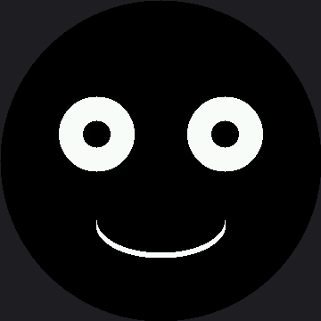

# Blinking

A wink is one eye. A **blink** is both eyes at once, and it means something entirely different — not
a signal to you, but a sign of life. This lab closes both eyes on a button press, which turns the
face from something that reacts to a timer into something that reacts to *you*.

## Reading a Button

Both buttons in this kit are wired the same way: one leg to a GPIO pin, the other leg to GND, with
the pin configured as a `PULL_UP` input.

```py
button_a, _ = config.init_buttons()
```

`PULL_UP` holds the pin at 1 until a press pulls it down to 0. So a pressed button reads **0**,
which feels backwards the first time and never again.

| Pin reading | What it means |
|---|---|
| 1 | Not pressed — the internal pull-up resistor is holding the line high |
| 0 | Pressed — the button has connected the pin to GND |

Button A is **GP14** and button B is **GP15**, set once in `config.py` as `BUTTON_A_PIN` and
`BUTTON_B_PIN`. Every kit in this book uses those same two pins — they sit on the first free GPIO
past the display's GP2-GP7 wiring block, on the breadboard alongside the Pico.

!!! mascot-thinking "Why Debounce Exists"
    { class="mascot-admonition-img" }
    A button's metal contacts physically bounce for a few milliseconds when they meet, so one press can look like five to a program fast enough to notice. Waiting 20 ms and checking again is the whole fix.

```py
def button_pressed():
    if button_a.value() == 1:
        return False
    sleep(0.02)              # debounce: let the contacts settle
    return button_a.value() == 0
```

## Sample Program Code

The mouth is drawn once and never touched again. `set_eyes()` erases both eye boxes and rebuilds
them in whichever state you ask for.

```py
# Lab 13: Blinking

import config
import shapes
from utime import sleep

display = config.init_display()
button_a, _ = config.init_buttons()

WHITE = config.WHITE
BLACK = config.BLACK
NO_FILL = config.NO_FILL
FILL = config.FILL

TOP_HALF = 3      # 1 (top right) + 2 (top left)
BOTTOM_HALF = 12  # 4 (bottom left) + 8 (bottom right)

HALF_WIDTH = config.WIDTH // 2
EYE_SPACING = 72
LEFT_EYE_X = HALF_WIDTH - EYE_SPACING
RIGHT_EYE_X = HALF_WIDTH + EYE_SPACING
EYE_Y = 150
EYE_RADIUS = 42
PUPIL_RADIUS = 15

BLINK_RADIUS_Y = 21
BLINK_Y = EYE_Y + 11
STROKE = 6

MOUTH_Y = 252
MOUTH_RADIUS_X = 72
MOUTH_RADIUS_Y = 36

EYE_BOX = EYE_RADIUS + 6


def draw_open_eye(x):
    shapes.ellipse(display, x, EYE_Y, EYE_RADIUS, EYE_RADIUS, WHITE, FILL)
    shapes.ellipse(display, x, EYE_Y, PUPIL_RADIUS, PUPIL_RADIUS, BLACK, FILL)


def draw_closed_eye(x):
    for offset in range(STROKE):
        shapes.ellipse(display, x, BLINK_Y + offset, EYE_RADIUS,
                       BLINK_RADIUS_Y, WHITE, NO_FILL, TOP_HALF)


def draw_smile():
    for offset in range(STROKE):
        shapes.ellipse(display, HALF_WIDTH, MOUTH_Y - offset,
                       MOUTH_RADIUS_X, MOUTH_RADIUS_Y,
                       WHITE, NO_FILL, BOTTOM_HALF)


def set_eyes(blinking):
    """Erase both eye boxes and redraw them in the requested state. The
    mouth is never touched -- it does not change, so it does not cost
    anything."""
    for x in (LEFT_EYE_X, RIGHT_EYE_X):
        display.fill_rect(x - EYE_BOX, EYE_Y - EYE_BOX,
                          EYE_BOX * 2, EYE_BOX * 2, BLACK)
        if blinking:
            draw_closed_eye(x)
        else:
            draw_open_eye(x)


def button_pressed():
    if button_a.value() == 1:
        return False
    sleep(0.02)              # debounce: let the contacts settle
    return button_a.value() == 0


def wait_for_release():
    while button_a.value() == 0:
        sleep(0.01)


def blink_once():
    set_eyes(True)     # both eyes snap shut
    sleep(0.15)        # a real blink is fast
    set_eyes(False)    # eyes open again


display.fill(BLACK)
draw_smile()
set_eyes(False)

while True:
    if button_pressed():
        blink_once()
        wait_for_release()
    sleep(0.01)
```

Here's the resting face, between blinks:



## Why wait_for_release() Matters

Without it, a finger held on the button for half a second would trigger dozens of blinks — the loop
runs far faster than you can lift your hand. `wait_for_release()` turns "the button is down" into
"the button was just pressed," which is almost always what you actually mean.

```py
def wait_for_release():
    while button_a.value() == 0:
        sleep(0.01)
```

!!! mascot-warning "This Loop Is Blocking, and That Is a Real Cost"
    { class="mascot-admonition-img" }
    While `blink_once()` runs its `sleep(0.15)`, nothing else in the program happens — no second button, no timer, no animation. That is fine here and a serious problem later, which is exactly what the [Don't Block the Loop](../no-blocking/index.md) lab is about.

## Things to Try

1. **Delete the debounce sleep** and press the button twenty times. Count how many blinks you get.
   The extra ones are real electrical events, not a software bug.
2. **Change the blink hold** from 0.15 to 0.6 seconds. A slow blink reads as sleepy or bored; a
   fast one reads as alert. You are tuning personality with a single number.
3. **Blink twice per press.** Two `blink_once()` calls with a short gap read very differently from
   one long blink.
4. **Remove `wait_for_release()`** and hold the button down. Now you know what it was preventing.

## References

- [Winking with a Smile](../wink/index.md) — one eye instead of two, and why that changes the meaning
- [Don't Block the Loop](../no-blocking/index.md) — how to blink on a timer without freezing everything else
- [Reading Two Buttons](../buttons/index.md) — the same pattern, doubled, with counters on screen
- [Blinking](../../smartwatch/blink/index.md) — the same lab on the smaller 1.2" kit
