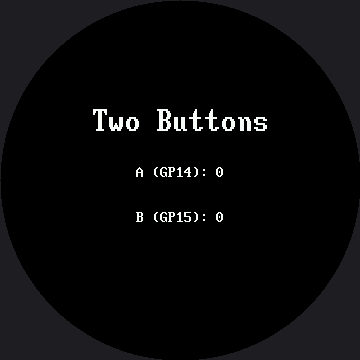

# Reading Two Buttons

Two buttons is all it takes to give a robot face a user interface. One steps forward, one steps
back, and suddenly every list you can write becomes a menu. This lab reads both buttons
independently and shows a running count for each, so you can prove your wiring works before you
build anything on top of it.

## Both Buttons Work Like the First One

They are wired exactly the way the single button in the [Blinking](../blink/index.md) lab was:
`PULL_UP` inputs that read 1 when idle and 0 when pressed, because the other leg of each button
goes to GND.

```py
button_a, button_b = config.init_buttons()
```

Button A is **GP14** and button B is **GP15**, set in `config.py` as `BUTTON_A_PIN` and
`BUTTON_B_PIN`. Those two pins are the standard across every kit in this book, including the 1.2"
Smartwatch kit, so a student who has built either one keeps their wiring habits when they swap
displays.

## Text Has To Be Centered Here — and Now So Does the Font

On the OLED, a status line started at `x=4` and that was that. On a round screen a left margin is
not a straight line: **how far in the text has to start depends on how far down the screen it is.**
That much is unchanged from the 1.2" kit. What's new here is that this lab draws its title in a
different font than its two count rows, so `centered()` has to take the font as an argument instead
of assuming one:

```py
def centered(font, string, y):
    x = HALF_WIDTH - (len(string) * font.WIDTH) // 2
    display.fill_rect(0, y, config.WIDTH, font.HEIGHT, BLACK)
    display.text(font, string, x, y, WHITE, BLACK)
```

"Two Buttons" is drawn in the 16×32 `BIG_FONT`, and the two count rows stay in the dense 8×16
`SMALL_FONT` — the same split this kit's `face.label()` makes, for the same reason: the bitmap
glyphs are fixed sizes, so a bigger screen makes 8×16 text a *smaller* fraction of what you see, not
a bigger one. Both the centering math and the erase height above read straight from `font.WIDTH`
and `font.HEIGHT` instead of a hard-coded 8 or 16, which is exactly why passing the font in as an
argument matters: get the erase height wrong for one row and you blank half a title or leave a
digit ghosted behind the next one.

!!! mascot-warning "Text Overprints — It Does Not Replace"
    { class="mascot-admonition-img" }
    With no frame buffer, drawing "9" where "10" was leaves the "1" sitting there forever. That `fill_rect()` is not tidiness — it is the only thing standing between you and a counter that turns into gibberish somewhere past nine.

## Sample Program Code

```py
import config
from utime import sleep

display = config.init_display()
button_a, button_b = config.init_buttons()

WHITE = config.WHITE
BLACK = config.BLACK
FONT = config.SMALL_FONT       # 8 x 16 -- the dense readout font
TITLE_FONT = config.BIG_FONT   # 16 x 32 -- readable from across the room
HALF_WIDTH = config.WIDTH // 2

TITLE_Y = 105    # 70 on the smartwatch kit
A_ROW_Y = 165    # 110
B_ROW_Y = 210    # 140


def centered(font, string, y):
    """Draw one centered line, erasing the strip it lands in first.

    The font comes in as an argument for one reason: both the centering
    and the erase depend on it. font.WIDTH sets where the line starts,
    and font.HEIGHT sets how many rows to blank. Ask the font and you
    cannot get either one wrong."""
    x = HALF_WIDTH - (len(string) * font.WIDTH) // 2

    # Erase the whole strip first, so a shorter number does not leave a
    # digit from the longer one behind it. font.HEIGHT is the glyph's
    # real height -- 16 here, 32 for the title -- not a scaled number.
    #
    # The strip runs the full 360 px even though the ends of it are under
    # the bezel. Erasing more than you need is always safe; erasing less
    # never is. Trimming it to the circle's width at this row would save
    # a few hundred bytes of SPI and is a fine exercise, but get the
    # arithmetic slightly wrong and you are back to ghosted digits.
    display.fill_rect(0, y, config.WIDTH, font.HEIGHT, BLACK)
    display.text(font, string, x, y, WHITE, BLACK)


def pressed(button):
    if button.value() == 1:
        return False
    sleep(0.02)              # debounce: let the contacts settle
    return button.value() == 0


def wait_for_release(button):
    while button.value() == 0:
        sleep(0.01)


def show_counts(a_count, b_count):
    centered(FONT, "A (GP14): " + str(a_count), A_ROW_Y)
    centered(FONT, "B (GP15): " + str(b_count), B_ROW_Y)


display.fill(BLACK)
centered(TITLE_FONT, "Two Buttons", TITLE_Y)

a_count = 0
b_count = 0
show_counts(a_count, b_count)

while True:
    if pressed(button_a):
        a_count += 1
        show_counts(a_count, b_count)
        wait_for_release(button_a)

    if pressed(button_b):
        b_count += 1
        show_counts(a_count, b_count)
        wait_for_release(button_b)

    sleep(0.01)
```

Here's the starting screen, before either button has been pressed:



## The Counters Are Your Wiring Test

Press A ten times and B five times. If the two numbers on screen match what your fingers did, your
buttons are wired correctly, your pull-ups are working, and your debounce is doing its job — all
confirmed before you build anything that depends on them.

If a count runs ahead of your presses, the debounce is too short. If it lags behind, something in
the loop is blocking. Both are much easier to diagnose here, on a screen with nothing else on it,
than inside a menu three labs from now.

!!! mascot-tip "Two Buttons Is a Whole Interface"
    { class="mascot-admonition-img" }
    Forward and back is enough to walk any list — seven emotions, five modes, ten animations. Everything from here to the end of the kit is built on the two buttons you just tested.

## Things to Try

1. **Take the `fill_rect()` out of `centered()`** and count past 9. The "1" from "10" sits on top of
   the old digit, because nothing erased it.
2. **Change `font.HEIGHT` in the erase call to a literal `16`** and run the title through it. The
   title is drawn in the 16×32 font, so blanking only 16 rows clears the top half of each letter and
   leaves the bottom half sitting there — the same bug as item 1, only harder to spot, because the
   erase box is the wrong *size* instead of missing entirely.
3. **Pass `WHITE` as the background color** for one row instead of `BLACK`. The driver really does
   paint that background behind each character, and now you can see it — and see that it only
   paints the glyph cells, which is why it can't substitute for the `fill_rect()` above.
4. **Count how many presses you can register in ten seconds.** Then remove `wait_for_release()` and
   try again. The second number is not a measure of your finger.

## References

- [Blinking](../blink/index.md) — the same button pattern with one button and a face
- [Mode Switching](../modes/index.md) — where forward and back become a real menu
- [Trace and Watch](../trace-and-watch/index.md) — where button state becomes part of an on-screen instrument
- [Reading Two Buttons on the 1.2" kit](../../smartwatch/buttons/index.md) — the same lab on the smaller 240×240 screen, where both the title and the counts share a single font
