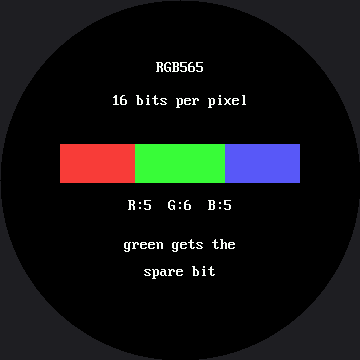

# Color and Bits

On the OLED kit a pixel was one bit. On or off. There was nothing to ask about it, and no lab could
have been written on the subject. On the [1.2" smartwatch kit](../../smartwatch/color-bits/index.md)
a pixel became a 16-bit number, and this lab is that same lesson, carried over unchanged, on a
bigger screen.

Here a pixel is a 16-bit number, and there is a great deal to ask. This is the one lab in the kit
that a monochrome display could not have taught, and what it teaches is **representation** — how a
real thing gets squeezed into a fixed number of bits, and what falls out along the way.

That question is not about displays. It is the same question behind MP3s, JPEGs, floating point, and
every file format you will ever open.

!!! mascot-welcome "Sixteen million colors go in. Sixty-five thousand come out."
    { class="mascot-admonition-img" }
    Something got thrown away in there, on purpose, by somebody who thought carefully about which parts you would miss least. Let's find out what — and why.

## The Whole Encoding, in One Line

This is `color565()`, straight from `lib/gc9b72.py`:

```py
def color565(red, green, blue):
    return (red & 0xF8) << 8 | (green & 0xFC) << 3 | blue >> 3
```

It is the same function, bit for bit, that the 1.2" kit's `lib/gc9a01.py` carries — the masks and
shifts did not change even though the driver underneath them did. That is worth pausing on: nothing
about this lab's math changed when the screen grew. Three 0–255 numbers go in. One 16-bit number
comes out:

```
bit  15 14 13 12 11 | 10 9 8 7 6 5 | 4 3 2 1 0
     R  R  R  R  R  | G  G G G G G | B B B B B
        5 bits      |    6 bits    |   5 bits
```

5 + 6 + 5 = 16. Count what that costs: you handed over 8 bits per channel and got back 5, 6, and 5.

| Channel | Bits in | Bits out | Distinct levels that survive |
|---|---|---|---|
| Red | 8 | 5 | 32 |
| Green | 8 | **6** | **64** |
| Blue | 8 | 5 | 32 |

## Two Questions Worth Answering Before You Press a Button

**Why does green get the extra bit?** Your eye is not an equal-opportunity detector. Most of your
sense of brightness comes from green light, some from red, and very little from blue. Spending the
one spare bit on green puts it where you are most likely to notice.

**Why not just store all 24 bits?** Do the arithmetic for this screen:

| Format | Bytes for a 360×360 screen |
|---|---|
| RGB565, 2 bytes per pixel | 259,200 |
| 24-bit color, 3 bytes per pixel | 388,800 |
| RP2040 RAM, total | 270,336 (264 KB) |

An RP2040 has 264 KB of RAM, and MicroPython is already using a chunk of it before your program even
starts. Even the 16-bit figure — 259,200 bytes, about 253 KB — barely leaves room for the code that
would have to hold it, and the 24-bit figure is bigger than the chip's entire memory, full stop.
**That is the same arithmetic that explains why this driver has no frame buffer and why there is no
`show()` in this kit** — on the smaller kit the same argument ran on 115,200 and 172,800 bytes, with
more slack in it. A bigger screen does not make this problem smaller; it makes it worse.

## Five Views

Button A steps through them; button B prints the numbers behind whichever one you are looking at to
the Thonny shell.

| View | What it shows |
|---|---|
| Bit layout | The three fields at their true relative widths — 75, 90, 75 pixels for 5, 6, 5 bits |
| Red vs green | Two ramps side by side. Count the bands: 32 against 64 |
| Blue | Blue alone, so its dimness is impossible to miss |
| All channels | All three together — the bands nearly vanish |
| Memory | The arithmetic above, on screen |

Here's the first view:



Look at the widths of those three colored blocks. They are not decoration — they are 75, 90, and 75
pixels wide, in the same proportion as 5, 6, and 5 bits. That bar got wider along with the screen; the
bits it is dividing did not change at all, which is exactly the point of this lab.

## Nothing Here Quantizes on Purpose

That is the clever part of the ramp views. The code asks for all 256 levels, one per column across a
280-pixel-wide band:

```py
def ramp(y, channel):
    """Draw a smooth 0-255 sweep of one channel and let the encoding
    break it into bands.

    Nothing here is quantizing on purpose. We ask for all 256 levels,
    one per column-ish, and color565() throws away the low bits on the
    way past. The stripes you see ARE the bits that did not fit."""
```

The stripes are not drawn. They are what is left when the encoder discards what it cannot keep. The
ramps live in a 280-pixel-wide band rather than a naive scaled-up 300, because the caption above each
ramp sits farther from center than the ramp itself — on a round screen, the widest thing in a column
decides where the whole column is allowed to start.

!!! mascot-thinking "Errors That Do Not Line Up Cancel Out"
    { class="mascot-admonition-img" }
    In the all-channels view the banding nearly disappears, and the reason is worth knowing: red, green and blue each round at different points, so a step in one is hidden by the other two moving with it. Independent errors are much less visible than one big one.

## Button B Counts Instead of Asserting

Press it on a ramp view and the program asks for all 256 levels of each channel and **counts how
many survive**:

```py
for channel, shift, mask in (("red", 11, 0x1f),
                             ("green", 5, 0x3f),
                             ("blue", 0, 0x1f)):
    seen = set()
    for level in range(256):
        if channel == "red":
            packed = config.color565(level, 0, 0)
        elif channel == "green":
            packed = config.color565(0, level, 0)
        else:
            packed = config.color565(0, 0, level)
        seen.add((packed >> shift) & mask)
    print("  %-5s 256 levels in -> %d distinct out"
          % (channel, len(seen)))
```

The answer is not asserted anywhere in that code — it is measured. That is the same habit the
[trace](../trace-and-watch/index.md), [redraw](../partial-redraw/index.md), and
[timing](../draw-speed-timing/index.md) labs have been building.

## Things to Try

1. **Count the bands in the red ramp** before you count the green ones. This screen makes it a
   little easier than the 1.2" kit did: the same 32 bands are spread across 280 pixels instead of
   200, so each one is wider and easier to pick out by eye.
2. **Press B on the ramp view** and compare the counted answer to the one you got by eye.
3. **Work out `color565(255, 0, 0)` on paper**, then press B and check. Hint: `255 & 0xF8 = 248`,
   and `248 << 8 = 0xF800`.
4. **Predict `color565(7, 3, 7)`.** All three values are small enough to be thrown away entirely, so
   the answer is pure black — which means there are 8 × 4 × 8 = 256 different "colors" your code can
   name that this display renders identically.
5. **Go back to the [emotion table](../emotion-table/index.md)** and look at why every color there is
   a pale mix rather than a pure channel. You now know exactly what that decision was buying.

## References

- [The Emotion Table](../emotion-table/index.md) — where `config.color565()` is first used in anger
- [The Color Wheel](../color-wheel/index.md) — all 65,536 colors in one circle, and whether this
  bigger screen finally has room to show them
- [Blitting Buffers](../blit/index.md) — where two bytes per pixel first showed up as a memory bill
- [Color and Bits on the 1.2" kit](../../smartwatch/color-bits/index.md) — the same lab, the same
  math, a smaller screen and a smaller memory bill
