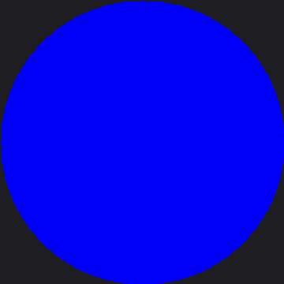

# Color and Resolution Demo

Every other lab in this kit teaches you a drawing technique. This one teaches you something more
basic first: whether your board actually works. Plug in a brand-new GC9B72 panel, run
`34-color-demo.py`, and six back-to-back test patterns tell you — in under a minute — whether every
wire lands where it should.

That makes this the lab to reach for the moment your wiring is finished, even though it sits near
the very end of the kit's lab numbers. It needs no buttons, no face code, and no judgment call about
whether an expression "looks right." It only needs a working display, and it will tell you plainly
whether it has one.

This lab and [Hello World](../hello/index.md) are the only two labs in the entire kit confirmed on
real hardware — not just in this book's simulator. Solid colors, gradients, and the full-screen
rainbow disc have all rendered correctly on an actual Raspberry Pi Pico wired to a real GC9B72 panel.

!!! mascot-welcome "Six Scenes, One Question: Does It Work?"
    { class="mascot-admonition-img" }
    Every pixel tells a story, and this program makes sure yours can tell one at all. Watch it loop through solid colors, gradients, a checkerboard, and a full rainbow before you trust it with a single face.

## The Six Scenes

The program cycles through these forever, two seconds apiece except where noted, until you unplug
the board or press Ctrl-C in Thonny:

| # | Scene | What it checks |
|---|---|---|
| 1 | Solid fills | Does every basic color — black, white, red, green, blue, yellow, cyan, magenta — reach the glass at all? |
| 2 | Color bars | A classic broadcast test pattern: all eight colors side by side, full height |
| 3 | RGB565 gradients | Three horizontal ramps, one per color channel — a live look at the bit-depth gap between red/blue and green |
| 4 | Checkerboard | Fine detail and pixel alignment, one 20×20 square at a time |
| 5 | Rainbow disc | Every hue at every saturation in one circle — the one scene whose shape matches the screen's own shape |
| 6 | Alignment target | A crosshair and border to catch mirroring, or a drawing window that doesn't reach every edge |

Each scene is its own function, and the whole file adds up to a self-contained diagnostic tool
you'll likely reach for again any time you wire up a new GC9B72 board from scratch.

## Sample Program Code

The screen is 360×360 pixels — 129,600 of them, or 259,200 bytes for a full RGB565 wipe — and every
scene below works from that same `W`, `H`, `CX`, `CY` set of globals. Start with the helper every
scene calls to caption itself:

```py
def label(text):
    """A one-line caption at the top of the screen, and the same text
    printed to the shell -- useful if the display isn't showing anything
    yet and you're debugging from the REPL instead."""
    print(text)
    x = CX - (len(text) * FONT.WIDTH) // 2
    display.fill_rect(0, 4, W, FONT.HEIGHT, BLACK)
    display.text(FONT, text, x, 4, WHITE, BLACK)
```

!!! mascot-thinking "The Shell Is a Second Screen"
    { class="mascot-admonition-img" }
    Notice that `print(text)` runs before anything touches the display. If your wiring is wrong and the glass stays dark, the shell will still show you every caption this program tries to draw — proof the code is running even when the picture isn't.

The first scene is the simplest possible test. The theory behind it: if this doesn't work, nothing
else in the file will either.

```py
SOLID_COLORS = (
    ("black", config.BLACK),
    ("white", config.WHITE),
    ("red", config.RED),
    ("green", config.GREEN),
    ("blue", config.BLUE),
    ("yellow", config.YELLOW),
    ("cyan", config.CYAN),
    ("magenta", config.MAGENTA),
)


def scene_solid_fills():
    for name, color in SOLID_COLORS:
        print("fill:", name)
        display.fill(color)
        sleep_ms(400)
```

Eight colors at 400 milliseconds apiece — call it 3.2 seconds before the color bars scene takes
over.

The gradient scene is where RGB565's bit depth stops being an abstract fact and starts being
something you can actually see. Red and blue each get 5 bits (32 levels); green gets 6 (64 levels).
The code sweeps every one of those levels across the screen's full 360-pixel width:

```py
def _gradient_row(width, channel_bits, make_color):
    """One row of `width` pixels, sweeping a channel from 0 to its max
    value, returned as `bytes` ready for blit_buffer()."""
    max_value = (1 << channel_bits) - 1
    row = bytearray(width * 2)
    pos = 0
    for x in range(width):
        level = x * max_value // (width - 1)
        color = make_color(level)
        row[pos] = color >> 8
        row[pos + 1] = color & 0xFF
        pos += 2
    return bytes(row)


def scene_gradients():
    band_h = H // 3
    bands = (
        (0, 5, lambda level: level << 11),         # red:   bits 15-11
        (band_h, 6, lambda level: level << 5),     # green: bits 10-5
        (band_h * 2, 5, lambda level: level),      # blue:  bits 4-0
    )
    for top, bits, make_color in bands:
        row = _gradient_row(W, bits, make_color)
        height = band_h if top < band_h * 2 else H - band_h * 2
        for r in range(height):
            display.blit_buffer(row, 0, top + r, W, 1)

    label("RGB565 gradients")
    sleep_ms(DWELL_MS)
```

Look closely at the rendered ramps and the green band should look visibly smoother than red or
blue — it has twice as many steps to spend across the same 360 pixels.

Next, a checkerboard for catching alignment problems a solid color can't show you:

```py
CELL = 20  # 360 / 20 = 18 cells across, evenly


def scene_checkerboard():
    display.fill(BLACK)
    for row, y in enumerate(range(0, H, CELL)):
        for col, x in enumerate(range(0, W, CELL)):
            if (row + col) % 2 == 0:
                display.fill_rect(x, y, CELL, CELL, WHITE)
    label("checkerboard")
    sleep_ms(DWELL_MS)
```

Eighteen squares across, eighteen down — 324 in total. A square that comes out non-square, or a
pattern shifted from the border, points straight at the driver's rotation or drawing-window setup.

The rainbow disc is the flagship scene — and the slowest one, because the RP2040 has no hardware
floating point. Every pixel's color depends on `atan2()` and `sqrt()`, both emulated in software, so
the math is the bottleneck here, not the SPI wire. The program warns you about this itself, printing
`"rainbow disc (this one takes a few seconds)..."` to the shell before it starts. Computing one color
per 2×2 block instead of per pixel — controlled by `BLOCK` below — cuts that math to a quarter
without a visible loss of detail:

```py
OUTER_R = min(CX, CY) - 5   # stay inside the visible glass
OUTER_R2 = OUTER_R * OUTER_R
BLOCK = 2
DEGREES_PER_RADIAN = 180.0 / pi
```

`OUTER_R` works out to 175 — five pixels shy of the physical glass edge, and a little bolder than the
`SAFE_RADIUS` of 168 that other labs in this kit use as a safety margin. This scene wants its disc to
nearly fill the round screen, since filling it is the whole point of a shape that matches the
screen's own shape.

The last scene is a deliberately boring one, and that is exactly its job — catching a mirrored or
offset drawing window before it ever reaches a face:

```py
def scene_alignment_target():
    display.fill(BLACK)
    display.rect(2, 2, W - 4, H - 4, WHITE)
    display.hline(0, CY, W, config.RED)
    display.vline(CX, 0, H, config.RED)

    tick = 10
    display.fill_rect(CX - 1, 2, 2, tick, config.YELLOW)             # N
    display.fill_rect(CX - 1, H - 2 - tick, 2, tick, config.YELLOW)  # S
    display.fill_rect(2, CY - 1, tick, 2, config.YELLOW)             # W
    display.fill_rect(W - 2 - tick, CY - 1, tick, 2, config.YELLOW)  # E

    caption = "alignment target"
    x = CX - (len(caption) * FONT.WIDTH) // 2
    display.text(FONT, caption, x, CY - 40, WHITE, BLACK)

    size = "{} x {}".format(W, H)
    x = CX - (len(size) * FONT.WIDTH) // 2
    display.text(FONT, size, x, CY - 20, WHITE, BLACK)

    print("alignment target")
    sleep_ms(DWELL_MS)
```

!!! mascot-tip "Read the Crosshair Like an Instrument"
    { class="mascot-admonition-img" }
    The border should touch all four edges evenly, and the red lines should cross exactly at the panel's center. If one side of the border is missing, or the crosshair sits off-center, that is a rotation or offset bug in the driver setup — not a problem with your eyes.

All six scenes are just entries in one tuple, looped forever:

```py
SCENES = (
    scene_solid_fills,
    scene_color_bars,
    scene_gradients,
    scene_checkerboard,
    scene_rainbow_disc,
    scene_alignment_target,
)

while True:
    for scene in SCENES:
        scene()
```

Here's what that program draws on the display:



This demo cycles through six different scenes forever, so a single picture can only catch whichever
one happened to be on screen when the image was made — here, it landed partway through the very
first scene, on blue. Run it on your own board and you'll watch every color, the gradients, the
checkerboard, the full rainbow disc, and the alignment target, in order, forever.

## Things to Try

1. **Time the solid fills scene with a stopwatch.** Eight colors at 400 milliseconds apiece works
   out to about 3.2 seconds — check your own board against that math.
2. **Change `CELL` from 20 to 40.** The checkerboard drops from 18×18 squares to 9×9. Is a wiring or
   rotation problem easier or harder to spot at the larger scale?
3. **Change `BLOCK` in the rainbow disc scene from 2 to 1.** That asks for four times as many
   `atan2()`/`sqrt()` calls — time the difference with a stopwatch and feel firsthand what "no
   hardware floating point" costs.
4. **Study the alignment target before you study anything else.** If your own board's crosshair or
   border looks wrong, that is worth fixing before you spend an afternoon debugging a face that was
   never going to draw straight.

## References

- [Hello World](../hello/index.md) — the other hardware-confirmed lab, and the simplest possible
  test of the driver
- [Screen Coordinates](../screen-coordinates/index.md) — the coordinate system this demo's six
  scenes all draw into
- [Color and Bits](../color-bits/index.md) — the RGB565 encoding behind the gradient scene's
  bit-depth story
- [The Color Wheel](../color-wheel/index.md) — the sibling lab whose row-at-a-time HSV technique the
  rainbow disc scene borrows
- [Demo Reel](../demo/index.md) — this kit's other button-free showcase, cycling through faces
  instead of color tests
