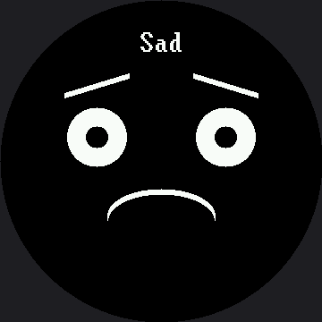

# Demo Reel

A self-running showcase that needs no buttons at all — the right program for a science fair
table, an open house, or a classroom shelf. It cycles through all seven emotions across the full
360 × 360 circle, blinking briefly between each one so the transitions read as **alive** instead
of a slideshow.

## The Blink Between Faces

That blink is still the whole design idea, and a bigger screen didn't change it. Cut straight
from one expression to the next and the face looks like a slideshow. Close the eyes for 120
milliseconds in between and the same sequence looks like a creature changing its mind.

```py
def blink_transition():
    display.fill(BLACK)
    for x in (LEFT_EYE_X, RIGHT_EYE_X):
        for offset in range(STROKE):
            # 26 -> 39 on the smartwatch kit
            shapes.ellipse(display, x, EYE_Y + offset, 39, BLINK_RADIUS_Y,
                           WHITE, NO_FILL, TOP_HALF)
    sleep(0.12)
```

!!! mascot-thinking "Animators Have Known This for a Century"
    { class="mascot-admonition-img" }
    A blink between poses hides the change and gives your eye something to do while my whole face rearranges itself. It still costs one function and 120 milliseconds — that number doesn't scale with the screen, because a blink is a human-timing thing, not a pixel-count thing.

## This Is Where a Full Wipe Is Right

After all the warnings about `display.fill(BLACK)` elsewhere in this book, this lab uses one on
every transition — and that is still the correct call here. It happens once every two seconds,
not sixty times a second, and it guarantees no leftovers from the previous face. On this panel a
full wipe is 129,600 pixels and 259,200 bytes down the SPI wire — 2.25 times what the same wipe
costs on the 1.2" kit's smaller screen — but 2.25 times almost nothing, twice a second, is still
almost nothing.

| Program | How often it redraws | Uses a full `display.fill(BLACK)`? |
|---|---|---|
| [Eye scanner](../eye-scanner/index.md) | dozens of times a second, sweeping the pupils | No — erases only the two eye boxes; see [Making the Eye Scanner Fast](../eye-scanner-speedup/index.md) |
| [Mode menu](../modes/index.md) | a few times a minute | Yes — and that's fine at this rate |
| This demo reel | once every two seconds | Yes — and that's fine at this rate |
| [Partial redraw](../partial-redraw/index.md) benchmark | tens of times a second | No — and it measures why not |

Judgment about *when* an optimization matters is worth as much as knowing how to do it — on a
360 × 360 panel just as much as on a 240 × 240 one.

## A Bigger Label, on Purpose

`show_emotion()` prints the emotion's name at the top of the circle, and on this kit that name is
drawn in the 16×32 `BIG_FONT`, not the 8×16 font the 1.2" kit's demo reel uses. Bitmap glyphs are
fixed-size images baked into `lib/` — they don't grow just because the screen did — so promoting
the label to the bigger font is what keeps "Surprised," the longest of the seven names, readable
from across a room instead of shrinking into a caption. At 16×32 it comes out to 144 px, against
roughly 199 px of visible circle at `LABEL_Y`.

That upgrade has a cost. `text()` paints a background as tall as the font behind every glyph, so
doubling the font doubled the label's black band from 16 rows to 32. At the naively-scaled
`LABEL_Y` of 45 (30 × 1.5), that band would have painted straight over the top of Afraid's raised
eyebrow. `LABEL_Y` moved to 32 instead, which clears it by a single row.

!!! mascot-tip "Bigger Screen Does Not Mean Bigger Text"
    { class="mascot-admonition-img" }
    My glyphs are baked-in bitmaps — they don't stretch just because my face got a bigger screen. Every emotion name here moved up to the bold 16×32 font so it still reads at a glance, and that's the real reason my label sits at row 32 instead of wherever you'd land by just multiplying by 1.5.

## Sample Program Code

The seven expression functions are identical to the ones in the
[expression menu](../emotion-modes/index.md). What is new is the loop at the bottom, which is
only five lines.

```py
def show_emotion(name, draw):
    display.fill(BLACK)
    draw()
    x = HALF_WIDTH - (len(name) * FONT.WIDTH) // 2
    display.text(FONT, name, x, LABEL_Y, WHITE, BLACK)


def blink_transition():
    display.fill(BLACK)
    for x in (LEFT_EYE_X, RIGHT_EYE_X):
        for offset in range(STROKE):
            # 26 -> 39 on the smartwatch kit
            shapes.ellipse(display, x, EYE_Y + offset, 39, BLINK_RADIUS_Y,
                           WHITE, NO_FILL, TOP_HALF)
    sleep(0.12)


while True:
    for name, draw in EMOTIONS:
        show_emotion(name, draw)
        sleep(2)
        blink_transition()
```

The full program is `20-demo.py` in the kit.

Here's one frame from the middle of the reel:



The reel shows one emotion at a time, so a single picture catches whichever face was up when the
image was made — here, Sad. Run it on your own board and you get all seven, two seconds apart.

## Things to Try

1. **Delete the blink transition** and watch the same seven faces without it. The difference is
   larger than 120 milliseconds has any right to be.
2. **Change the hold** from 2 seconds to 4. Longer holds feel calm and a little sad; shorter ones
   feel manic. Find the timing that suits the personality you want.
3. **Reorder the emotions** so the reel tells a story — bored, curious, surprised, happy. A
   sequence is a narrative, not just a list.
4. **Add a fade.** Show each face, then redraw it with face-sized shapes in a dimmer color before
   the blink. You will need a color from `config.color565()`; the
   [color bits lab](../color-bits/index.md) explains how to pick one that stays visible.

## References

- [The Expression Menu](../emotion-modes/index.md) — the same seven expressions, driven by
  buttons
- [Standalone main.py](../sample-main-demo/index.md) — the demo reel plus a button menu, ready to
  run with no computer attached
- [Blinking](../blink/index.md) — where the closed-eye arc used in the transition comes from
- [Demo Reel on the 1.2" kit](../../smartwatch/demo/index.md) — the same lab at 240×240, with the
  label in the smaller 8×16 font
