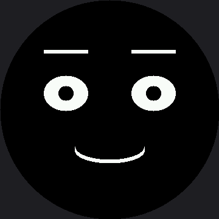

# Design Your Own Emotion

This is the capstone, and it is the only lab that does not tell you what to draw. You are going to
invent expressions nobody in this kit has drawn before, and then find out whether a stranger can
read them.

That last part is the real test. **A robot face is not art you look at — it is a message you send.**
If the person standing next to your robot cannot tell proud from confused, the expression does not
work yet, no matter how good it looks to you.

!!! mascot-welcome "This is the superpower, in your hands"
    { class="mascot-admonition-img" }
    Communicating a feeling that lands correctly in somebody else's head is the whole thing this kit has been building toward. Let's draw some feelings — yours this time.

## Use All Four Habits

| Habit | What it means here |
|---|---|
| **Decomposition** | Break the feeling into eyes, eyebrows, and mouth, and decide what each part does before you code |
| **Pattern recognition** | Add a row to the table — do not write a new function, because you already know it would look like all the others |
| **Abstraction** | Build only from `face.py`'s parts, so your emotion inherits every fix the module ever gets |
| **Debugging** | When it does not read right, change ONE number, look, and change one more |

## Step 1: Write the Brief in Words First

Fill this in before you touch a single number:

```
My emotion is: ................ (proud? confused? shy? suspicious?)
The eyes are:  ................ (wide? narrow? looking away?)
The eyebrows:  ................ (raised? one up? angled down?)
The mouth is:  ................ (smile? flat? open? off to one side?)
The closest emotion it might be confused with is: ................
and I will keep them apart by: ................
```

Writing that down first is not busywork. It is the decomposition step, and skipping it is why most
first attempts read as "generic robot."

## Step 2: Turn Each Line Into a Number

```py
#            name    eye_rx eye_ry brow_L brow_R lift  mouth        x   y  color
MY_EMOTIONS = [
    ("Proud",        36,    29,    0,     0,    11,  face.SMILE,  57, 21,
     config.color565(255, 200, 90)),

    # TODO: your first emotion. Start by copying the row above and
    # changing ONE column at a time, looking after each change.

    # TODO: your second emotion. Make it one that could be confused with
    # your first, then push them apart until a tester can tell them apart.
]
```

One row is filled in as a worked example. Study it before you replace it: "Proud" is a small
confident smile with the brows lifted and the eyes relaxed — pleased, but not surprised.

Every number in that table is a pixel number, and it belongs to this 360×360 panel and nothing
else. The smartwatch kit runs the same table on a 240 px screen with every figure scaled down by
two-thirds — its `eye_rx` ceiling is 34, not 51. If you ever borrow a row from that kit, scale it
first; if you lend one to it, say which screen it was designed for.

| Column | Range that works | Note |
|---|---|---|
| `eye_rx` / `eye_ry` | Keep `eye_rx` under about 51 | Wider and the eyes start disappearing under the bezel |
| `brow_L` / `brow_R` | roughly −18 to 18 | Two different values give you a skeptical, lopsided brow |
| `lift` | roughly −10 to 27 | A big lift reads as surprise |
| `mouth style` | `SMILE`, `FROWN`, `FLAT`, `OPEN`, `SMIRK`, `SNEER` | |
| `color` | `config.color565(r, g, b)` | **Pick this last** — see below |
| `name` (stage 3 reveal) | 12 characters or fewer | `face.label()` draws in this kit's bigger 16×32 font, so a name eats twice the vertical band it did on the smartwatch kit's smaller one |

That last row is worth pausing on. Every Ekman emotion name still fits under 12 characters — but
the ceiling itself is new, and it exists because of the label font, not because of anything about
your design.

!!! mascot-warning "Pick the Color Last"
    { class="mascot-admonition-img" }
    Step 3 tests whether the color helped, and you cannot answer that question if the color was there from the start — you will have been tuning both at once and will not know which one is doing the work.

## Step 3: Run the Readability Test as a Controlled Experiment

Every face gets shown to your tester in three stages, and button A moves to the next one:

| Stage | What they see | What you ask |
|---|---|---|
| 1. Shape only | The face in plain white, no label | "What is the robot feeling?" — write down their exact word |
| 2. With color | The same face, same shapes, in your color, no label | Ask again; write that word down too |
| 3. Reveal | The name you intended | Nothing — just show them |

Only **one thing** changed between stage 1 and stage 2, which is what makes this an experiment
instead of a demo. Three outcomes are possible, and all three teach you something:

| Outcome | What it means |
|---|---|
| The word got **closer** to what you intended | Color reinforced a shape that was already nearly right. This is the win, and it is real. |
| The word **did not change** | Your shapes were carrying the meaning alone. Keep the color if you like it — but know it is decoration here, not communication. |
| The word got **worse**, or they hesitated | Usually the color is too dark to read across the room, or it is fighting the expression. Fix the shape first. |

Test at least three people. If two of them say something you did not intend at stage 1, the
expression needs work — and their wrong word is your best clue about which feature is misleading
them. Do not reach for color to paper over it.

Here's the worked example at stage 1, shape only:



## A Round Screen Helps You Here

With no corners and no rectangular frame, there is nothing in the picture except the face. Whatever
your tester reads, they read from the expression alone — no border, no background, no visual
furniture to lean on.

This panel also gives you an edge the smartwatch kit doesn't have. At 360×360 you have 129,600
pixels describing the picture, against the smartwatch kit's 57,600 — 2.25 times as many pixels
tracing every curve. A subtle eyebrow angle that turned into a jagged staircase on the smaller
screen can survive intact here. Use the extra resolution, but keep testing from across the room, not
from arm's length — that's the distance your finished robot will actually be read from.

## Step 4: The Checklist

Check your work against this before calling it finished:

| Check | Done? |
|---|---|
| I wrote the design brief in words before coding | |
| Each emotion is ONE row of data, not a function | |
| I used only `face.py` parts, no raw `shapes` calls | |
| Every part of the face is inside the circle | |
| My emotion names are 12 characters or fewer | |
| Three testers named the emotion at stage 1, with no color at all | |
| I can say which single feature carries the meaning | |
| It still reads correctly from across the room | |
| My color has enough green in it to stay bright | |
| The emotion still reads for a color-blind tester | |

The "inside the circle" check has a tool, so use it instead of squinting: `config.inside_circle(x, y)`
is true for any point within `config.SAFE_RADIUS` of the middle. Check the outer edge of each eye
and both ends of the mouth — those are the points a big number pushes toward the bezel first.

Those last two rows are engineering rules, not decoration rules. Your eye takes most of its sense of
brightness from green light and almost none from blue, so a face in pure blue is a dark face however
vivid the number looks in the code — see [Color and Bits](../color-bits/index.md) for the
arithmetic. And roughly one boy in twelve has a red-green color deficiency — if red means angry and
green means happy on your robot, it says nothing at all to somebody in most classrooms.

The fix is free: **make the shape carry the meaning and let the color agree with it.** If your face
passed stage 1, you already did this.

## Where to Take It Next

- **[Keyframes](../keyframes/index.md)** — give your emotion an entrance animation. A feeling that
  arrives over 300 ms reads far more alive than one that snaps on, and
  [Only Redraw What Changed](../partial-redraw/index.md) is what makes that animation smooth on a
  display with no frame buffer.
- **[A Face With a Memory](../state-machine/index.md)** — add it as a state, so the robot can arrive
  at your emotion on its own instead of waiting for a button.
- **[Standalone main.py](../sample-main-demo/index.md)** — rename your finished program `main.py`
  and the robot wears your expression the moment it gets power, with no computer attached.

!!! mascot-celebration "Look what you built"
    { class="mascot-admonition-img" }
    You started this kit by blinking an LED. You are finishing it with a robot that has a face of your own design on a real 2.1" round display, a personality with a memory, and opinions about being poked — and every part of it is something you can explain, measure, and fix. That is the superpower. Go build something with it.

## References

- [The Emotion Table](../emotion-table/index.md) — the column format your rows use
- [The Face Module](../face-module/index.md) — the parts you are building from
- [Live Face Parameters](../face-parameters/index.md) — the fastest way to find the numbers you want
- [Design Your Own Emotion on the 1.2" kit](../../smartwatch/design-your-own/index.md) — the same
  lab on the smaller 240×240 screen, where the numbers are two-thirds of these
