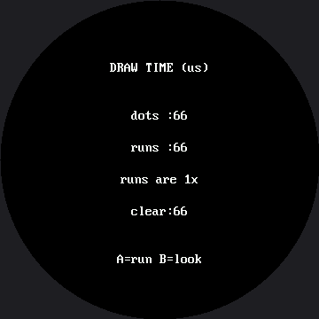

# How Fast Is a Face?

The OLED kit ran this lab to compare a hand-written ellipse against `framebuf`'s built-in one, and
the built-in won by a mile because it was compiled into the firmware and the hand-written one was
not. That is a fair race, and it has an obvious answer.

You cannot run that race here either, because **this display has no built-in ellipse.**
`shapes.ellipse()` is MicroPython, written in a file you can open. So the question changes into a
better one:

> Both versions are MicroPython. Both walk the same math. One of them is much faster anyway. **Why?**

How much faster, on this board, is a number nobody has measured yet. The smartwatch kit's version of
this lab found roughly ten times, but that figure was measured on a Pico driving a GC9A01 — a
different controller, a different driver, and 57,600 pixels against this panel's 129,600. None of it
carries over, so none of it is claimed here. The measuring machinery below is real and honest: run
it, and the ratio it prints is *your* measurement of *your* board.

!!! mascot-welcome "Same language, same math, a lot more speed"
    { class="mascot-admonition-img" }
    This is my favorite result in the whole kit, because the answer is not "the fast one is written in C." Both of these are written in the same Python. Something else entirely is going on.

## Dots Against Runs

| Version | How it draws | Calls per filled eye |
|---|---|---|
| **Dots** | `display.pixel()`, one call per pixel | ~4,100 |
| **Runs** | `shapes.ellipse()`, one `hline()` per row | 73 |

Both send exactly the same 8,200 bytes of actual color. The difference is how many separate
**conversations** each one has with the display.

## The Ellipse Equation, Without Division

The dots version is worth reading on its own, because it contains a trick worth keeping. The ellipse
equation says a point is inside when:

$$\frac{dx^2}{r_x^2} + \frac{dy^2}{r_y^2} \le 1$$

Division is slow and inexact, so multiply both sides out first. The same test becomes whole-number
arithmetic with no division at all:

$$dx^2 \cdot r_y^2 + dy^2 \cdot r_x^2 \le r_x^2 \cdot r_y^2$$

```py
def dot_ellipse(cx, cy, rx, ry, color, fill, bottom_half=False):
    rx2 = rx * rx
    ry2 = ry * ry
    limit = rx2 * ry2

    # For an outline we keep the pixels that are inside the shape but NOT
    # inside a shape one pixel smaller. What is left over is the edge.
    inner_rx2 = (rx - 1) * (rx - 1)
    inner_ry2 = (ry - 1) * (ry - 1)
    inner_limit = inner_rx2 * inner_ry2
    has_inner = inner_rx2 > 0 and inner_ry2 > 0

    for dy in range(-ry, ry + 1):
        if bottom_half and dy < 0:
            continue
        dy2_rx2 = dy * dy * rx2
        for dx in range(-rx, rx + 1):
            if dx * dx * ry2 + dy2_rx2 > limit:
                continue                      # outside the ellipse
            if not fill and has_inner:
                if dx * dx * inner_ry2 + dy * dy * inner_rx2 <= inner_limit:
                    continue                  # inside the edge, so skip it
            display.pixel(cx + dx, cy + dy, color)
```

Everything else in that function is just that one test, run on every pixel in the shape's bounding
box. The extra `inner_*` lines add a second, slightly smaller version of the same test, so this one
function can also draw an unfilled outline by subtracting a shape one pixel smaller — which is
exactly what this lab's mouth curve needs, since it is drawn as an open arc, not a filled disc.

## A Benchmark You Can Trust

Two rules make a benchmark trustworthy, and both are in the code:

```py
def time_drawing(draw, repeats):
    """Return the average microseconds one call to draw() takes.

    Two rules make a benchmark trustworthy, and both are here:

      1. Run it once first and throw that result away. The first call has
         to allocate things the later ones reuse, so it is never typical.
      2. Time several runs and average them. One reading of anything this
         fast is mostly noise; an average is a measurement.
    """
    draw()                                    # warm-up, not counted

    started = ticks_us()
    for _ in range(repeats):
        draw()
    return ticks_diff(ticks_us(), started) // repeats
```

The full-screen wipe is timed **separately**, because both faces pay it and leaving it inside the
comparison would hide the difference you are actually looking for. Expect it to be the biggest
number on the screen: this panel is 129,600 pixels, which is 259,200 bytes over SPI — 2.25 times the
smartwatch kit's 115,200-byte wipe, because area scales with the square of the side length, not the
side length itself.

Here's the report on screen:



The numbers in that picture came from a simulated run with a fake clock, so they are not meaningful
— the timings that matter are the ones your own board prints. Press A to run the benchmark and B to
flip between the report and the two faces, so you can confirm you are comparing like with like.

!!! mascot-warning "Trust Your Board, Not a Screenshot"
    { class="mascot-admonition-img" }
    Every timing number in this lab is a measurement of *your* hardware, at *your* baud rate, with *your* wiring. That is the whole point of building the instrument — so write down what your board says, not what a picture says.

## Why Runs Win

Both versions are interpreted MicroPython. Both do about the same arithmetic. The difference is
almost entirely in what they say to the display.

**1. Fewer conversations.** Setting a drawing window costs two commands and eight bytes, and it
happens on *every* `display.pixel()` call. A filled eye of radius 36 is roughly 4,100 pixels
(π × 36²), so the dots version pays that overhead 4,100 times to send 8,200 bytes of color. The runs
version pays it 73 times — once per row, since an eye of radius 36 is 73 rows tall — and sends
exactly the same 8,200 bytes.

**2. Fewer Python function calls.** A MicroPython method call is not free. 4,100 calls to `pixel()`
versus 73 calls to `hline()` is a real saving on its own, before a single byte reaches the wire.

Reason 1 is the big one, and it generalizes: **on any device you talk to over a bus — a display, an
SD card, a sensor, a network — batching your requests usually beats optimizing the work inside
them.** Both effects get worse as pixel count grows, and this panel has 2.25 times as many pixels as
the smartwatch kit's — reason enough to expect the gap here to be at least as wide as it is there.
But expecting is not measuring, and the ratio your own board prints is the only evidence that counts.

## There Is a Third Tier — But Not Here

The smartwatch kit's GC9A01 has an escape hatch this lab can't reach. Russ Hughes also publishes
[`gc9a01_mpy`](https://github.com/russhughes/gc9a01_mpy) — the same driver written in C and compiled
into a custom MicroPython firmware, with a real `ellipse()` built in. Installing it is roughly the
jump the OLED kit measured between hand-written and built-in code.

Nothing like that exists for the GC9B72. The only C implementation of this controller anyone has
published is an Arduino C++ driver — `lib/gc9b72.py` is MicroPython all the way down, with no
compiled alternative to switch to. On this panel, **batching is the optimization**, full stop. If you
ever outgrow it, the next step isn't a faster Python trick — it's writing the driver in C yourself.

## Things to Try

1. **Predict the ratio before you run it.** Write your guess down, then write down what the board
   actually prints. Nobody has recorded that number for a GC9B72 yet, so yours is as good a
   measurement as exists. (Careful: if you run this under `src/utils/check-labs.py`, the clock is
   fake and the numbers it prints mean nothing — only a real board counts.)
2. **Compare both drawing times to `face.clear()`.** Which dominates a frame for the dots face?
   Which for the runs face? The answer flips, and that flip is exactly why
   [partial redraw](../partial-redraw/index.md) mattered so much.
3. **Make the eyes bigger** — change `EYE_R` from 36 to 60 — and run again. The dots time grows with
   the **area** of the eye; the runs time grows with its **height**, because that is how many
   `hline()` calls it makes. Growth rate matters more than any single measurement.
4. **Turn the fast version into the slow one.** Open `lib/shapes.py` and change the fill branch of
   `ellipse()` to use `display.pixel()` in a loop. Three lines, and you have located exactly where
   the speed was living.
5. **Time the other calls the same way.** How long does one `fill_rect()` take compared to drawing
   the same block with an `hline()` per row? You now own a method that answers questions like that
   in two minutes.

## References

- [Only Redraw What Changed](../partial-redraw/index.md) — the other big speed lever on this display
- [Drawing Ellipses](../ellipse/index.md) — the function whose implementation this lab is racing
- [Drawing Pixels](../pixel/index.md) — where the cost of one `pixel()` call was first described
- [How Fast Is a Face? on the 1.2" kit](../../smartwatch/draw-speed-timing/index.md) — the same lab
  on the smaller 240×240 kit, where the roughly-10x figure above was actually measured
