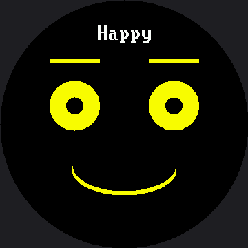

# The Emotion Table

Go back and look hard at the [expression menu](../emotion-modes/index.md). It has seven functions —
`draw_happy`, `draw_sad`, `draw_angry`, and four more — and every single one has the same three
lines in the same order: set the eyes, set the eyebrows, set the mouth.

Only the numbers change.

Once you see that, you cannot unsee it, and the moment has a name.

!!! mascot-welcome "Spot the repeat"
    { class="mascot-admonition-img" }
    Seven functions that differ only in their numbers are not really seven functions. Let's find out what they actually are.

## Pattern Recognition

**Pattern recognition** means noticing that several things share a structure, so you can handle
them all with one piece of code instead of one piece each. It is the thinking skill that turns a
long program into a short one.

If seven functions differ only in their numbers, then the numbers are the real content and the
function around them is just packaging. So put the numbers in a table, write the packaging once,
and let one function draw all seven.

!!! mascot-thinking "Data and Code Are Different Things"
    { class="mascot-admonition-img" }
    Ten numbers describing a feeling are *data*. The instructions for turning numbers into pixels are *code*. Keeping them in separate places is one of the oldest good ideas in programming.

## Seven Emotions, Eight Lines

Each emotion becomes one row. Read the columns straight across, and the whole emotional range of
the robot fits on one screen:

```py
# name  eye_rx  eye_ry  brow_L  brow_R  lift  mouth style  size_x  size_y  color
EMOTIONS = (
    ("Happy",     36, 36,   0,   0,   8, face.SMILE, 75, 36, config.YELLOW),
    ("Sad",       33, 33, -10, -10,   0, face.FROWN, 60, 30, SOFT_BLUE),
    ("Angry",     36, 18,  18,  18,  -7, face.FLAT,  39,  0, SOFT_RED),
    ("Afraid",    47, 47, -18, -18,  11, face.OPEN,  23, 33, VIOLET),
    ("Surprised", 48, 48,   0,   0,  21, face.OPEN,  30, 39, config.CYAN),
    ("Disgusted", 33, 23,  15,  -7,  -4, face.SNEER, 45, 27, LIME),
    ("Contempt",  36, 36,   0,   0,   0, face.SMIRK, 51,  0, WHITE),
    # ("Bored",   36, 15,   0,   0, -10, face.FLAT,  42,  0, config.GREEN),
)
```

Before you can read that table you need to know what each column controls. Every one of these is a
knob you already turned by hand in an earlier lab:

| Column | What it controls | What changing it does |
|---|---|---|
| `eye_rx`, `eye_ry` | The eye's width and height | A tall eye reads alert; a squashed one reads angry or bored |
| `brow_L`, `brow_R` | Each eyebrow's tilt | Positive angles the inner end down into an angry V |
| `lift` | How high both brows sit | A big lift is the fastest way to say "surprised" |
| `mouth style` | Which shape the mouth takes | `SMILE`, `FROWN`, `FLAT`, `OPEN`, `SMIRK`, or `SNEER` |
| `size_x`, `size_y` | The mouth's width and curve depth | A wide shallow curve reads friendlier than a deep one |
| `color` | What the whole face draws in | A new axis of expression, for the cost of one column |

## One More Column

That color column is the whole point of this section. Adding it required **no new drawing code, no
new function**, and no change to `draw_emotion()` beyond unpacking one more name.

That is what "the numbers are the real content" buys you: a brand-new axis of expression costs one
column.

```py
WHITE = config.WHITE
SOFT_BLUE = config.color565(120, 170, 255)
SOFT_RED = config.color565(255, 110, 110)
VIOLET = config.color565(200, 160, 255)
LIME = config.color565(150, 230, 120)
```

`config.color565(red, green, blue)` takes three ordinary 0–255 values and packs them into the
16-bit number the display wants. The [color bits lab](../color-bits/index.md) takes that function
apart and shows you exactly what it does to them.

Notice what did, and did not, change when this kit's labs grew from the 1.2" kit's 240×240 panel to
this one's 360×360: every eye radius and mouth size above is 1.5 times the 1.2" kit's, but not one
color changed. A coordinate is a fact about how many pixels you have; a color is not.

Notice too that Contempt is deliberately left white. **"No color" is a design choice too**, and a
table that lets you say so is a better table.

## One Function Draws All of Them

Here is the entire drawing half of the program. There is no `draw_happy`, no `draw_angry`, and no
`if` statement asking which emotion this is.

```py
def draw_emotion(row):
    """Draw ANY row from the table above. This is the only drawing code in
    the lab -- the seven expressions are data, not seven functions."""
    (name, eye_rx, eye_ry, brow_l, brow_r, lift,
     style, size_x, size_y, color) = row

    face.clear()
    face.set_color(color)
    face.eyes(eye_rx, eye_ry)
    face.eyebrows(brow_l, brow_r, lift)
    face.mouth(style, size_x, size_y)
    face.label(name, color=WHITE)   # the caption stays white, always

    print("drawing", name, row[1:])
```

That first statement does the work. **Tuple unpacking** takes the ten values in the row and hands
each one its own name, in order, in a single statement. From there the function neither knows nor
cares which emotion it is drawing.

That `face.label()` call is worth a second look, too. On this kit it draws in a wide 16×32 font
instead of the smaller font the 1.2" kit's labels use — the bigger screen would otherwise make text
read proportionally smaller, not larger — but it is still the same one call regardless of which
kit's `face.py` you imported.

Here's the first row of the table, drawn:



The menu shows one row at a time, so this picture is Happy — the first row. Press button A to walk
the rest of the table.

!!! mascot-warning "The Columns Must Line Up"
    { class="mascot-admonition-img" }
    Unpacking matches by position, not by name. Put the mouth style where the lift belongs and MicroPython will happily try to draw an eyebrow lifted by the word "smile" — so count your columns when you add a row.

## The One Rule About Color

**Color may reinforce an expression. It must never be the only thing carrying it.**

That is not fussiness, and there are two concrete reasons for it. Roughly one boy in twelve has a
red-green color deficiency, so an angry-red/happy-green scheme says nothing at all to somebody in
most classrooms. And color survives photographs, video calls, and bright windows far worse than
shape does.

There is also a perceptual trap worth knowing before you pick colors. Your eye takes most of its
sense of brightness from green light and almost none from blue:

| Color | Perceived brightness (white = 255) |
|---|---|
| Pure green `0x07E0` | 180 |
| Pure red `0xF800` | 53 |
| Pure blue `0x001F` | 18 |

That is why every color in the table above is a pale mix with plenty of green in it, rather than a
pure channel. A "blue" face is a dark face.

## The Real Payoff

Adding an eighth emotion to the old program meant writing a new function, adding it to the menu
tuple, and hoping you matched the style of the other seven. Adding one here costs a single line.

| Task | Seven functions | One table |
|---|---|---|
| Add an emotion | Write a function, register it | Add one row |
| Reorder the menu | Reorder a tuple of function names | Reorder rows |
| Make every mouth wider | Edit seven functions | Edit one column |
| Add color to every emotion | Edit seven functions | Add one column |
| Store the set on disk or send it over a network | Not possible — code is not data | Straightforward — rows are just numbers |

That last row is worth a second look. Because your emotions are now plain numbers, a robot could
download a new personality the way it downloads a file.

!!! mascot-celebration "Seven feelings, one function"
    { class="mascot-admonition-img" }
    You just replaced fifty lines of near-identical code with eight rows of numbers, and gained the ability to add a feeling in one line. Let's draw some feelings!

## Things to Try

1. **Uncomment the "Bored" row.** You just added an emotion without writing one line of drawing
   code. Now invent a row of your own.
2. **Make Sad sadder** by editing only its numbers — try `eye_ry` 26 and a brow tilt of −18.
3. **Give one emotion a lopsided brow.** Set `brow_L` to 18 and `brow_R` to −10 on Contempt and see
   how much a single mismatched eyebrow changes the meaning.
4. **Sort the table** so the emotions run from most positive to most negative. Because they are
   data, sorting the menu is just reordering lines.
5. **Predict the widest eye this screen can hold, then measure it.** An eye centered
   `face.EYE_SPACING` (72 px) off the axis and `face.EYE_Y` (153 px) down sits about 77 px from the
   center of the glass, so it should run out of room around `face.SAFE_RADIUS` (168) − 77 ≈ 91. Push
   one emotion's `eye_rx` up and see how close your guess lands — `SAFE_RADIUS` is itself an
   estimate on this kit.
6. **Set every color to `WHITE`** and step through again. Can you still tell the seven apart? You
   should be able to — the shapes were doing that work before the colors existed.
7. **Try `config.BLUE` on one emotion**, then `SOFT_BLUE`, and look at both from across the room.
8. **Add a color column to the [state machine](../state-machine/index.md)'s `POSES` table** so the
   robot's mood changes hue as its state changes. One column, again, and no new drawing code.

## References

- [The Face Module](../face-module/index.md) — the `face.mouth()` style names that let a row of data pick a shape
- [The Expression Menu](../emotion-modes/index.md) — the seven hand-written functions this lab replaces
- [Color and Bits](../color-bits/index.md) — what `config.color565()` actually does to your three numbers
- [The Emotion Table on the 1.2" kit](../../smartwatch/emotion-table/index.md) — the same seven rows at 240×240, worth comparing to see exactly which numbers scaled and which didn't
