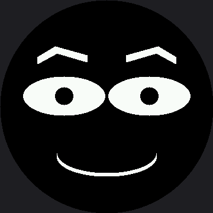

# Eyebrows

If you could keep only one part of a robot face, keep the eyebrows. They carry more emotional
information per pixel than the eyes and the mouth combined, and this lab builds them out of
`poly()` so they can **bend** instead of just tilting.

## Why a Polygon Instead of a Line

A straight diagonal line reads as an eyebrow, barely. A four-point polygon with a bend in the
middle reads as an eyebrow that *belongs to somebody*. The curve is what does it.

```py
left_eyebrow = array('h', [-45, 0, -15, -18, 39, -3, 39, 9, -12, -6, -45, 12])
right_eyebrow = array('h', [45, 0, 15, -18, -39, -3, -39, 9, 12, -6, 45, 12])
```

Every number is an offset from the eyebrow's anchor point, in signed shorts, so negative offsets
are allowed — which is what lets the shape be written around a center rather than from a corner.
Read the two arrays side by side and you will see the second is the first with its x-values
negated: the mirror image, written by hand. Every one of those offsets is also the smartwatch
kit's number times 1.5 — they are pixel *offsets*, not positions, so leaving them at the smaller
kit's values would have drawn a brow two-thirds the size of the eye it has to sit over.

!!! mascot-thinking "The Cost of a Filled Brow"
    { class="mascot-admonition-img" }
    `shapes.poly()` fills a shape by drawing one horizontal run per row it covers. A brow this size is about thirty rows — thirty runs down the wire, still cheap. Open `lib/shapes.py` and read the scanline fill if you have not yet.

## Sample Program Code

```py
import config
import shapes
from array import array

display = config.init_display()
ON = config.WHITE
OFF = config.BLACK
FILL = config.FILL
NO_FILL = config.NO_FILL

WIDTH = config.WIDTH
HALF_WIDTH = WIDTH // 2

EYE_Y = 162          # 108 on the smartwatch kit
EYE_WIDTH = 69       # 46
EYE_HEIGHT = 33      # 22
PUPIL_RADIUS = 15    # 10
LEFT_EYE_X = 108     # 72
RIGHT_EYE_X = 252    # 168
MOUTH_Y = 264        # 176
MOUTH_WIDTH = 84     # 56
STROKE = 6           # 4

# Each point is an offset from the eyebrow's anchor. Signed shorts, so
# negative offsets are allowed -- which is what lets the shape be written
# around a center instead of from a corner.
left_eyebrow = array('h', [-45, 0, -15, -18, 39, -3, 39, 9, -12, -6, -45, 12])
right_eyebrow = array('h', [45, 0, 15, -18, -39, -3, -39, 9, 12, -6, 45, 12])


def draw_eye(x):
    shapes.ellipse(display, x, EYE_Y, EYE_WIDTH, EYE_HEIGHT, ON, FILL)
    shapes.ellipse(display, x, EYE_Y, PUPIL_RADIUS, PUPIL_RADIUS, OFF, FILL)


def draw_face():
    display.fill(OFF)

    draw_eye(LEFT_EYE_X)
    shapes.poly(display, LEFT_EYE_X, EYE_Y - 66, left_eyebrow, ON, FILL)

    draw_eye(RIGHT_EYE_X)
    shapes.poly(display, RIGHT_EYE_X, EYE_Y - 66, right_eyebrow, ON, FILL)

    # mouth: bottom half of an ellipse (mask 12 = 4 + 8)
    for offset in range(STROKE):
        shapes.ellipse(display, HALF_WIDTH, MOUTH_Y - offset,
                       MOUTH_WIDTH, 33, ON, NO_FILL, 12)


draw_face()
```

Here's what that program draws on the display:



Look at how much attitude those two shapes add compared with a flat line. Same eyes, same mouth —
completely different character.

## The Eyebrow Vocabulary

Almost every emotion in this kit is reachable by changing two things about the brows: their **tilt**
and their **lift**.

| Brow position | Reads as |
|---|---|
| Inner ends angled down toward the nose | Angry, determined |
| Inner ends angled up | Sad, worried, pleading |
| Both raised high and flat | Surprised |
| Both low and flat | Bored, skeptical |
| One up, one down | Doubtful — the single most useful mismatched face |

!!! mascot-tip "One Number, Opposite Mood"
    { class="mascot-admonition-img" }
    Flip the sign on the second number of each array — the `-18` — and the brows arch the other way. One character in the file, and my whole face changes what it is saying.

## Things to Try

1. **Flip the arch**, as in the tip above, and describe the new expression in one word before you
   look at anything else.
2. **Draw the brows with `NO_FILL`.** An outlined brow is a thin wire frame, and the bigger this
   panel gets, the worse a one-pixel outline looks — the same single row of pixels now has to
   carry a face half again as wide as the smartwatch kit's.
3. **Give the two brows different shapes** by editing one array. A face with mismatched brows reads
   as skeptical, and it takes exactly one changed number to get there.
4. **Move the anchor.** Change `EYE_Y - 66` to `EYE_Y - 45` so the brows sit closer to the eyes. A
   low brow crowds the eye and reads as intensity; a high one reads as openness.

## References

- [Drawing Polygons](../poly/index.md) — the scanline fill that makes a curved brow possible
- [Drawing Lines](../lines/index.md) — the straight-line eyebrow, and the rule about which way to tilt
- [The Emotion Table](../emotion-table/index.md) — where brow tilt and lift become two columns of data
- [Eyebrows (1.2" smartwatch kit)](../../smartwatch/eyebrows/index.md) — the same lab at 240×240, where every offset in the polygon arrays is two-thirds this size
