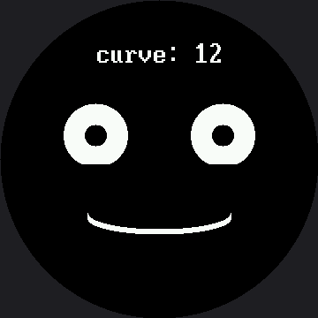

# Live Face Parameters

Every expression so far has used fixed numbers baked into the code. This lab makes one number
**live**: button A widens the smile, button B narrows it and then bends it into a frown, and the
face redraws instantly so you can watch a single parameter bend the whole mood in real time.

It is the fastest way to develop an intuition for how faces actually work, and it turns a
programming exercise into an experiment you can run on people.

!!! mascot-welcome "Turn the knob and watch me change my mind"
    { class="mascot-admonition-img" }
    One number controls the curve of my mouth. Push it up and I'm delighted; push it down and I'm disappointed. Somewhere in between is a value where nobody can tell — and finding that number is a real discovery.

## One Number, Two Mouths

The curve value does double duty. Positive means smile, negative means frown, and the sign picks
the quadrant mask:

```py
    # a positive curve smiles (BOTTOM_HALF), a negative curve frowns (TOP_HALF)
    if mouth_curve >= 0:
        mask = BOTTOM_HALF
        radius_y = mouth_curve + 6
    else:
        mask = TOP_HALF
        radius_y = -mouth_curve + 6
```

| `mouth_curve` | Mask | What you see |
|---|---|---|
| +48 | `BOTTOM_HALF` | A deep, delighted grin |
| +12 | `BOTTOM_HALF` | A gentle, pleasant smile — the starting value |
| 0 | `BOTTOM_HALF` | A nearly flat line — neutral |
| −36 | `TOP_HALF` | A deep frown |

## "Instantly" Is Doing Real Work

The eyes never change, so they are drawn once and never touched again. Only the mouth's box and
the readout strip are erased and rebuilt on a press. Redraw the whole screen instead — 129,600
pixels, 259,200 bytes down the SPI wire on this panel — and the response stops feeling instant. It
starts feeling like a page loading.

```py
# The box the mouth can never escape: widest radius, deepest curve in
# either direction, plus a margin. Work this out from the numbers above
# rather than guessing, or you will be chasing leftovers all afternoon.
MOUTH_BOX_X = HALF_WIDTH - MOUTH_WIDTH - 6
MOUTH_BOX_Y = MOUTH_Y - MOUTH_CURVE_MAX - STROKE - 6
MOUTH_BOX_W = (MOUTH_WIDTH + 6) * 2
MOUTH_BOX_H = (MOUTH_CURVE_MAX + STROKE + 6) * 2
```

Read those four lines carefully. Every one of them is **derived** from the limits the program
already declares, rather than typed in as a guess. That is how you size an erase box correctly the
first time.

## Sample Program Code

```py
# Lab 22: Face Parameters -- Live Tuning (excerpt)

MOUTH_CURVE_MIN = -36             # -24
MOUTH_CURVE_MAX = 48              # 32
MOUTH_CURVE_STEP = 6              # 4


def draw_mouth(mouth_curve):
    display.fill_rect(MOUTH_BOX_X, MOUTH_BOX_Y,
                      MOUTH_BOX_W, MOUTH_BOX_H, BLACK)

    if mouth_curve >= 0:
        mask = BOTTOM_HALF
        radius_y = mouth_curve + 6
    else:
        mask = TOP_HALF
        radius_y = -mouth_curve + 6

    for offset in range(STROKE):
        shapes.ellipse(display, HALF_WIDTH, MOUTH_Y - offset,
                       MOUTH_WIDTH, radius_y, WHITE, NO_FILL, mask)


def draw_readout(mouth_curve):
    text = "curve: " + str(mouth_curve)
    display.fill_rect(0, LABEL_Y, config.WIDTH, FONT.HEIGHT, BLACK)
    x = HALF_WIDTH - (len(text) * FONT.WIDTH) // 2
    display.text(FONT, text, x, LABEL_Y, WHITE, BLACK)


def update(mouth_curve):
    draw_mouth(mouth_curve)
    draw_readout(mouth_curve)


display.fill(BLACK)
draw_eyes()

mouth_curve = 12                  # 8 on the smartwatch kit
update(mouth_curve)

while True:
    if pressed(button_a):
        mouth_curve = min(MOUTH_CURVE_MAX, mouth_curve + MOUTH_CURVE_STEP)
        update(mouth_curve)
        wait_for_release(button_a)

    if pressed(button_b):
        mouth_curve = max(MOUTH_CURVE_MIN, mouth_curve - MOUTH_CURVE_STEP)
        update(mouth_curve)
        wait_for_release(button_b)

    sleep(0.01)
```

The full program is `22-face-parameters.py` in the kit.

Here's the starting state, at `curve: 12`:



## The Readout Is the Point

That `curve: 12` on screen is not decoration. It means every discovery you make is a **number**
you can write down, hand to somebody else, and put straight into the
[emotion table](../emotion-table/index.md).

Look again at `draw_readout()`'s erase line: `display.fill_rect(0, LABEL_Y, config.WIDTH,
FONT.HEIGHT, BLACK)`. `FONT.HEIGHT` is read off the font module itself, not hardcoded — so it
erases 32 rows, the true height of `BIG_FONT`, not the 16 you'd get by copying the smartwatch
kit's number. Get that height wrong and the bottom half of every changing digit survives the
erase, and the readout turns into a smear.

Notice also that `LABEL_Y` itself is 45 here — the plain 1.5×-scaled value from the smartwatch
kit's 30, not the 32 used in the demo reel and the standalone main.py. Those two labs move their
label up to protect Afraid's raised eyebrow; this lab never calls `draw_eyebrows()` at all, so
there is no eyebrow to clip, and the naive scale is perfectly safe here.

!!! mascot-tip "You Are Doing Real Human-Factors Research"
    { class="mascot-admonition-img" }
    Find the exact curve where the face stops reading as happy and starts reading as neutral. Then find where neutral becomes sad. Those two numbers are a genuine finding about how people read faces — and you measured them yourself.

## Things to Try

1. **Find the two thresholds** described in the tip above, then ask three other people to find
   them too. Do you all agree? Where you disagree is the interesting part.
2. **Shrink `MOUTH_BOX_H` by thirty** and run to the extremes. The old mouth's ends survive the
   erase and pile up. The box has to be big enough for the **largest** thing that can appear in
   it, not the current one.
3. **Change `FONT.HEIGHT` in `draw_readout()` to a hardcoded 16** and hold a button down. The
   bottom half of every digit stays behind and the readout turns into a smear — the exact bug
   this kit's port had to fix everywhere: the coordinates scaled by 1.5, the glyphs did not.
4. **Make a second parameter live.** Borrow the `draw_eyebrows()` pattern from the
   [demo reel](../demo/index.md), add it to the setup, and put the eyebrow lift on a third
   button — or let holding button B change what button A adjusts instead. Two knobs is a much
   richer instrument than one.

## References

- [The Expression Menu](../emotion-modes/index.md) — where those fixed numbers came from
- [The Emotion Table](../emotion-table/index.md) — where the numbers you discover here belong
- [Design Your Own Emotion](../design-your-own/index.md) — the capstone, where tuning becomes
  designing
- [Live Face Parameters on the 1.2" kit](../../smartwatch/face-parameters/index.md) — the same
  lab at 240×240, tuning from −24 to 32 instead of −36 to 48
