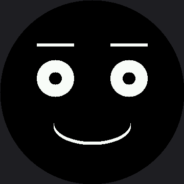

# Your First Face

This is the moment the kit has been building toward. Everything so far has been one shape at a
time; here they come together into an expression a stranger can read from across the room.

The whole face is three small functions — `draw_eyes()`, `draw_eyebrows()`, and a curved mouth.
Every later lab reuses this exact pattern with different numbers to draw every other emotion, so
it is worth understanding completely before you move on.

!!! mascot-welcome "Let's draw some feelings"
    { class="mascot-admonition-img" }
    Two eyes, two eyebrows, and one curve. That is the entire vocabulary — and it is enough to make somebody smile back at a machine. Every pixel tells a story!

## The Face Finally Gets To Be Face-Shaped

The numbers in this lab are bigger than the OLED kit's, and bigger again than the smaller 1.2"
smartwatch kit's — and neither jump is a simple "make it bigger." The OLED was 128 wide and 64
tall — twice as wide as it was tall — so its faces had to be squashed to fit. Both round screens are
square, so the proportions can stay honest; this one just has more of them.

| Feature | OLED kit | Smartwatch (1.2") | This kit (2.1") |
|---|---|---|---|
| Screen | 128 × 64 rectangle | 240 × 240 circle | 360 × 360 circle |
| Eye spacing from center | 26 | 48 | 72 |
| Eye radius | 10 | 24 | 36 |
| Stroke width | 1 pixel | 4 pixels | 6 pixels |

That last row matters more than it looks. **One pixel is invisible on a screen this size.** Every
line and arc in this kit is drawn several times, a pixel apart, to thicken it — look for
`for offset in range(STROKE)` and you will see it everywhere from here on.

## Sample Program Code

Read the three drawing functions first, then look at how few lines it takes to combine them.

```py
# Lab 10: Happy Face

import config
import shapes

display = config.init_display()
WHITE = config.WHITE
BLACK = config.BLACK
NO_FILL = config.NO_FILL
FILL = config.FILL
BOTTOM_HALF = 12

HALF_WIDTH = config.WIDTH // 2
EYE_SPACING = 72
LEFT_EYE_X = HALF_WIDTH - EYE_SPACING
RIGHT_EYE_X = HALF_WIDTH + EYE_SPACING
EYE_Y = 153
PUPIL_RADIUS = 12

EYEBROW_HALF_WIDTH = 36
EYEBROW_Y = EYE_Y - 60

MOUTH_Y = 246

# One pixel is invisible on a screen this size, so lines and arcs get
# drawn several times, a pixel apart, to thicken them.
STROKE = 6


def draw_eye(x, rx, ry):
    shapes.ellipse(display, x, EYE_Y, rx, ry, WHITE, FILL)
    shapes.ellipse(display, x, EYE_Y, PUPIL_RADIUS, PUPIL_RADIUS, BLACK, FILL)


def draw_eyes(rx, ry):
    draw_eye(LEFT_EYE_X, rx, ry)
    draw_eye(RIGHT_EYE_X, rx, ry)


def draw_eyebrow(x, side, lift):
    # side: 1 for the left eyebrow (nose to the right), -1 for the right
    y = EYEBROW_Y - lift
    for offset in range(STROKE):
        display.line(x - EYEBROW_HALF_WIDTH * side, y + offset,
                     x + EYEBROW_HALF_WIDTH * side, y + offset, WHITE)


def draw_eyebrows(lift):
    draw_eyebrow(LEFT_EYE_X, 1, lift)
    draw_eyebrow(RIGHT_EYE_X, -1, lift)


def draw_mouth_curve(radius_x, radius_y, mask):
    for offset in range(STROKE):
        shapes.ellipse(display, HALF_WIDTH, MOUTH_Y - offset,
                       radius_x, radius_y, WHITE, NO_FILL, mask)


def draw_happy_face():
    display.fill(BLACK)
    draw_eyes(36, 36)
    draw_eyebrows(lift=8)
    draw_mouth_curve(75, 36, BOTTOM_HALF)


draw_happy_face()
```

Here's what that program draws on the display:



## Three Functions, One Face

Look at `draw_happy_face()`. It is four lines, and every one of them is a decision about feeling
rather than about pixels:

| Line | The decision it makes |
|---|---|
| `display.fill(BLACK)` | Start from a clean screen |
| `draw_eyes(36, 36)` | Round, relaxed eyes — not wide, not squashed |
| `draw_eyebrows(lift=8)` | Brows sitting slightly high, which reads as pleased |
| `draw_mouth_curve(75, 36, BOTTOM_HALF)` | A wide, gentle smile — mask 12 curves up |

That separation is the reason every emotion in this kit is only a handful of numbers away. Change
`36, 36` to `36, 18` and the same face looks annoyed. Change `BOTTOM_HALF` to `TOP_HALF` and it
looks disappointed.

!!! mascot-tip "The Wipe Is the Expensive Part"
    { class="mascot-admonition-img" }
    Count how long the face takes to appear. Most of that is `display.fill(BLACK)` — 259,200 bytes of black going down the wire, since 360 × 360 is 129,600 pixels at two bytes each. Comment it out, run twice in a row, and you will see how fast the face itself really is.

## Things to Try

1. **Time the wipe**, as in the tip above. Write the number down; it comes back in almost every
   animation lab.
2. **Move `EYE_Y` from 153 to 90.** The eyes climb toward the rim and start losing their outer
   edges to the bezel, because the screen gets narrower the further you get from the middle.
3. **Make it angry with three edits.** Change the eyes to `(36, 18)`, the lift to `-8`, and the
   mouth mask to `3`. Same functions, opposite mood.
4. **Add a catchlight** to each eye with `fill_rect()`, using the trick from the
   [pixel lab](../pixel/index.md). Two tiny white squares change how alive the face looks.

## References

- [Drawing Ellipses](../ellipse/index.md) — the quadrant masks that make the mouth curve up or down
- [Eye Scanner](../eye-scanner/index.md) — the next lab, where this face starts moving
- [The Face Module](../face-module/index.md) — where these three functions move into one shared file
- [Your First Face](../../smartwatch/happy-face/index.md) — the same lab on the smaller 240 × 240
  kit, where every one of these numbers is exactly two-thirds as big
