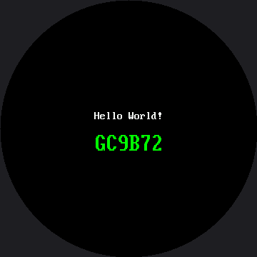

# Hello World

A "Hello World!" program is the first thing you write on any new project. The goal is not to build
anything impressive — it is to prove that your tools, your wiring, and your board all agree with
each other before you start counting on them. This one does that, and it also introduces the
single biggest surprise in this kit for anyone coming from the [OLED kit](../../oled/hello-world/index.md).

This lab is one of only two in this kit confirmed running on real hardware — the
[Color and Resolution Demo](../color-demo/index.md) is the other. Most of what follows in this kit
comes from a simulator or from reading the code, but a real Pico wired to a real GC9B72 panel has
genuinely shown these two lines of text, in these two fonts, in these two colors.

## The Shared Configuration File

Every lab in this kit imports one shared file, `config.py`, which holds the hardware facts — which
pin the clock is on, how big the screen is, where the center of the circle sits. Keeping those
numbers in one place means the labs stay short and you only ever fix a wiring change once.

```py
import config

display = config.init_display()
```

`init_display()` starts the SPI bus, resets the GC9B72 controller, and hands you back a display
object. From that point on, everything you draw goes through it.

## Text Needs a Font Module

Here is the line that trips up everyone porting code from the OLED kit — though if you already
built the 1.2" kit's Hello World lab, this part will feel familiar, since the same rule applies
there too:

```py
display.text(config.SMALL_FONT, "Hello World!", 132, 155, config.WHITE, config.BLACK)
#            ^^^^^^^^^^^^^^^^^ not optional
```

The SSD1306 driver was built on MicroPython's `framebuf` module, which ships a fixed 8 by 8 font
compiled into the firmware. **This driver has no built-in font at all.** So `text()` takes a font
**module** as its first argument, and `config.py` imports two of them for you:

| Constant | Module | Size | Characters across the widest part |
|---|---|---|---|
| `config.SMALL_FONT` | `vga1_8x16.py` | 8 × 16 | 45 |
| `config.BIG_FONT` | `vga1_bold_16x32.py` | 16 × 32 | 22 |

Both font modules live in `lib/` on the board, and they are **not optional** — `config.py` will
not even import without them.

!!! mascot-thinking "There Is No show() on This Display"
    { class="mascot-admonition-img" }
    On the OLED, drawing poked bits into a RAM buffer and `show()` shipped the whole thing to the glass. This driver has no buffer at all — every call goes straight down the wire. So there is no `show()` to forget, and no `show()` to call. Your text is already on the screen before the next line of code runs.

## Sample Program Code

Two lines of text, one in each font, in two different colors, so you can compare them side by
side on real glass.

```py
import config

display = config.init_display()

display.fill(config.BLACK)

# The small font: 8 pixels wide, 16 tall. "Hello World!" is 12 characters
# * 8 px = 96 px wide, so x=132 centers it on the 360 px screen.
display.text(config.SMALL_FONT, "Hello World!", 132, 155,
             config.WHITE, config.BLACK)

# The big font: 16 x 32, readable from across the room. "GC9B72" is
# 6 characters * 16 px = 96 px wide, so it centers at the same x.
display.text(config.BIG_FONT, "GC9B72", 132, 185,
             config.GREEN, config.BLACK)
```

Notice the second line asks for `config.GREEN`, not white. That is a small deliberate touch on a
driver that had never been proven on real glass before this lab ran: two lines in two different
colors are stronger proof that color really works than two lines of white would be.

Here's what that program draws on the display:



## Why Both Numbers in text() Matter More Here

The last two arguments are the foreground and background colors, and this driver really does paint
that background behind every character. That turns out to be useful: it is the cheapest way to
overwrite a short string with another one of the same length.

It is also a trap in the other direction. Because there is no frame buffer, **text overprints — it
does not replace.** Draw "9" where "10" used to be and the "1" stays on the glass forever. The
[Reading Two Buttons](../buttons/index.md) lab makes you hit that one on purpose.

!!! mascot-warning "If Nothing Appears, Don't Start Rewiring Yet"
    { class="mascot-admonition-img" }
    Run the [Connection Test](../connection-test/index.md) first. It imports nothing from this kit, so it still works when the driver or the fonts are missing — which tells you instantly whether the trouble is the board or the display.

## Things to Try

1. **Move the text off the edge.** Change the small font's x from 132 to 0 and run it again. The
   first few characters vanish under the bezel, because on a round screen the left margin is not a
   straight line.
2. **Count characters.** Write a 22-character string in `BIG_FONT` at y=185, then try 23. The
   twenty-third character has nowhere left to go on a 360-pixel-wide screen.
3. **Swap the colors.** Pass `config.BLACK` as the foreground and `config.WHITE` as the background
   for the small-font line, and watch the driver paint a solid white box with black letters cut out
   of it.

## References

- [Screen Coordinates](../screen-coordinates/index.md) — where on this round screen text is actually safe to put
- [Reading Two Buttons](../buttons/index.md) — where overprinted text becomes a bug you have to fix
- [OLED Hello World](../../oled/hello-world/index.md) — the same lab on the monochrome kit, for comparison
- [Hello World on the 1.2" kit](../../smartwatch/hello/index.md) — the same lab, same font trap, on the smaller round screen
