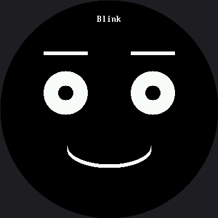

# Keyframes

The [emotion table](../emotion-table/index.md) turned seven expressions into seven rows of data.
This lab does the same trick to **motion**.

Every animation so far has been hand-written: a blink was some drawing, a sleep, some more drawing.
Change the timing and you edit code. But an animation is really just a list of poses and how long
each one holds — which is a table. Animators have called those poses **keyframes** for a hundred
years, and the idea works exactly as well on a $4 microcontroller as it does in a cartoon studio.

!!! mascot-welcome "Motion is data too"
    { class="mascot-admonition-img" }
    Write the player once and every animation becomes three lines of numbers that anyone on your team can tune without touching a single drawing call.

## One Frame Is Three Numbers

```py
#                eye  brow   ms
BLINK = (
    (36,  8,  60),
    (21,  8,  40),
    (3,   8,  70),
    (21,  8,  40),
    (36,  8,   0),
)
```

| Column | Meaning | Range that matters |
|---|---|---|
| `eye_height` | How tall the eyes are | 36 is open, 3 is shut |
| `eyebrow_lift` | How far the brows rise above resting | −11 droops, 27 is startled |
| `hold_ms` | How long to sit on this pose | 0 means "this is the last one" |

Read `BLINK` down the first column: 36, 21, 3, 21, 36. Open, half, shut, half, open. The animation
is right there in the numbers, and you can see it without running anything.

Notice which of those three columns changed when this lab crossed over from the smaller kit. The
first two are pixels, so they were multiplied by 1.5 — the smartwatch kit's 24 became 36, and its
18-degree startled lift became 27. The third column is time, and a millisecond means the same thing
on a 240-pixel screen and a 360-pixel one, so every `hold_ms` below is the exact number the
animator originally chose.

## The Player Knows Nothing About Blinking

Four variables are the player's entire memory. It does not know what a blink is, or what surprise
looks like. It only knows how to walk a list of poses in time — which is why it can play all four
animations in the lab, and every one you invent later.

```py
def update():
    """Advance the animation if the current pose has held long enough.
    This returns instantly when there is nothing to do, so the main loop
    stays free to watch the buttons -- the lesson from lab 15, applied to
    something more interesting than a single blink."""
    global playing, frame_index, frame_started

    if playing is None:
        return

    hold_ms = playing[frame_index][2]
    if ticks_diff(ticks_ms(), frame_started) < hold_ms:
        return

    frame_index += 1
    if frame_index >= len(playing):
        playing = None      # animation finished; last pose stays on screen
        return

    frame_started = ticks_ms()
    draw_frame(playing[frame_index])
```

That function returns instantly when there is nothing to do, so the main loop stays free to watch
the buttons — the lesson from the [no-blocking lab](../no-blocking/index.md), applied to something
more interesting than a single blink.

## Animations Built From Other Animations

Because the animations are data, ordinary list operations work on them:

```py
DOUBLE_BLINK = BLINK[:-1] + BLINK   # two blinks, built from the first one
```

That single line trims the last frame off `BLINK` and glues another `BLINK` onto it. No new drawing
code, no new player logic. Try building that from a hand-written animation and you will appreciate
the difference.

!!! mascot-thinking "Data Composes; Code Does Not"
    { class="mascot-admonition-img" }
    You can slice a table, reverse it, glue two together, or sort it. None of those things make sense on a block of hand-written drawing calls — and that is the whole argument for keeping motion in a list.

## Sample Program Code

```py
# Lab 27: Keyframes (excerpt -- the animations and the drawing)

SURPRISE = (
    (36,  8,  80),
    (51, 27, 500),
    (45, 21, 180),
    (36,  8,   0),
)

DOZE_OFF = (
    (36,  3, 350),
    (26,  0, 350),
    (15, -8, 400),
    (3, -11, 900),
    (36,  3,   0),
)

ANIMATIONS = (
    ("Blink", BLINK),
    ("Blink x2", DOUBLE_BLINK),
    ("Surprise", SURPRISE),
    ("Doze off", DOZE_OFF),
)


def draw_frame(frame):
    """Erase the eye box, draw this pose into it, and stop. The mouth and
    the label are already correct on the glass from start(), so redrawing
    them would be pure wasted wire time -- and on this display, wasted
    wire time is the only kind of slowness there is."""
    eye_height, brow_lift, hold_ms = frame
    face.erase(BOX_X, BOX_Y, BOX_W, BOX_H)
    face.eyes(EYE_WIDTH, eye_height)
    face.eyebrows(0, 0, brow_lift)
```

The full program is `27-keyframes.py` in the kit.

Here's the first animation, at rest:



## A Real Bug the Erase Box Caused — and a Font That Would Not Fit

There is a comment in this lab worth reading in full, because it documents a bug that a rendered
screenshot caught and a person did not:

```py
# face.py's default LABEL_Y (45) would put a caption's bottom edge at row
# 77 -- twenty-three rows INSIDE this animation's own erase box, which
# starts at BOX_Y (54). Every draw_frame() erase call would quietly bite
# the bottom two thirds off the name on screen, and the geometry never
# triggers an error, it just eats the tails of every letter. Moving the
# box down does not fix it either -- SURPRISE lifts the eyebrows by 27,
# reaching row 66, which is why BOX_Y sits where it does. The label has
# to move instead.
LABEL_Y = 24                            # 16 on the smartwatch kit
```

That is the failure mode of partial redraw in one paragraph. The erase box has to know about
everything it overlaps, and nothing warns you when it does not.

On the smartwatch kit, fixing this was a one-line move: slide `LABEL_Y` up and keep calling
`face.label()`. Here, moving the number was not enough, because `face.label()` draws in the 16×32
font on this kit. "Blink x2" at that size is 128 pixels wide, and the widest safe row 24 rows down
a 360-pixel circle is only about 114 pixels — no `LABEL_Y` would have made it fit. So this caption
uses `face.centered_text()` instead, the same 8×16 font every raw `text()` call in this book already
uses, which needs only 64 pixels and clears with room to spare. Bigger screen, smaller relative
text, and this time the fix cost a whole font, not just a row number.

## Things to Try

1. **Make the blink slower** by changing only numbers — turn the 70 in the middle of `BLINK` into
   400. A snappy reflex becomes a heavy, tired droop, and you never touched the player. (That 70 is
   milliseconds, so it is the same number on both kits.)
2. **Build a `TRIPLE_BLINK`** in one line, the same way `DOUBLE_BLINK` was built.
3. **Add a fourth number to every frame** — a mouth width — so the mouth animates too. You change
   `draw_frame()` once and every animation gains a moving mouth. You will also need a second erase
   box, and working out where it goes is most of the work.
4. **Play an animation backward** by reversing the list. Does `DOZE_OFF` reversed read as waking up?
   Some motions are reversible and some are not, which is a real animation-design question.
5. **Put `face.clear()` at the top of `draw_frame()`** instead of `face.erase()`. Same picture, and
   the animation turns into a flickering slideshow — and it costs more here than it did on the
   smartwatch kit, because clearing this screen means sending 259,200 bytes instead of 115,200.
6. **Set `face.DEBUG_ERASE = config.RED`** before playing `SURPRISE`. The erase box turns into a
   visible red rectangle with the pose drawn on top of it, so you can watch exactly how much glass
   each frame repaints — and confirm for yourself that the caption at `LABEL_Y` sits safely outside
   it.

## References

- [The Emotion Table](../emotion-table/index.md) — the same data-over-code move, applied to appearance
- [Don't Block the Loop](../no-blocking/index.md) — why the player checks the clock instead of sleeping
- [Only Redraw What Changed](../partial-redraw/index.md) — the erase-box discipline this lab depends on
- [Keyframes on the 1.2" kit](../../smartwatch/keyframes/index.md) — the same tables at 240×240, where the caption never had to change font
