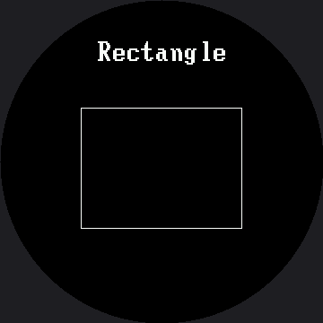

# Mode Switching

Two buttons and a list are all you need for a menu. Button A moves forward, button B moves back,
and the `%` (modulo) operator wraps the index around automatically so the list loops from the last
entry back to the first with no extra `if` checks.

This is a small lab with a big payoff: every menu in the rest of the kit is this exact pattern with
a different list.

## The Modulo Trick

```py
mode_index = (mode_index + 1) % len(MODES)   # forward, wraps to 0
mode_index = (mode_index - 1) % len(MODES)   # back, wraps to the end
```

MicroPython's `%` returns a non-negative result for a positive divisor, so `-1 % 5` is `4` — which
means going backward off the front of the list lands you neatly on the last entry. No special case
required.

| Expression | With `len(MODES) == 5` |
|---|---|
| `(4 + 1) % 5` | `0` — wrapped forward |
| `(0 - 1) % 5` | `4` — wrapped back |

## A List of (name, function) Pairs

The other idea in this lab is storing functions in a tuple alongside their names. A function is
just a value in Python, so it can sit in a list exactly like a number can.

```py
MODES = (
    ("Rectangle", draw_rectangle),
    ("Circle", draw_circle),
    ("Triangle", draw_triangle),
    ("Lines", draw_lines),
    ("Ring", draw_ring),
)
```

!!! mascot-thinking "This Table Grows Into Everything"
    { class="mascot-admonition-img" }
    Five shapes today, seven emotions in a few labs, and eventually a whole table of numbers that describes my entire emotional range. The shape of the code never changes — only what is in the list.

## The Mode Name Moves to the Big Font

Every position in this lab is the 1.2" kit's number times 1.5 — except the font, because bitmap
glyphs are fixed 8×16 and 16×32 shapes that don't get bigger just because the screen did. Left in
the small font, the mode name would cover a *smaller* fraction of this screen than it did on the
1.2" kit, so it moves up to the 16×32 font here — the same promotion this kit's `face.label()`
makes for emotion names:

```py
FONT = config.BIG_FONT   # config.SMALL_FONT on the 1.2" kit
```

`"Rectangle"` is the longest mode name at 9 characters, which comes to 144 px in the big font —
comfortably inside the roughly 191 px the visible circle gives you at `LABEL_Y`. Unlike the
Expression Menu lab, where the label had to move off its naive scaled position to clear a raised
eyebrow, `LABEL_Y` here is simply 28 × 1.5 = **42**, because none of these five demo shapes reach
that high on the screen. There's no face to protect, so the naive scale just works.

## Sample Program Code

```py
import config
import shapes
from array import array
from utime import sleep

display = config.init_display()
button_a, button_b = config.init_buttons()

WHITE = config.WHITE
BLACK = config.BLACK
NO_FILL = config.NO_FILL
FILL = config.FILL

# A mode name is a title, and a title on a 360 px screen wants the big
# glyphs. The centering math in show_mode() reads FONT.WIDTH rather than
# a hardcoded 8, so it comes out right whichever font this line names --
# which is exactly why you never scale a font width by hand.
FONT = config.BIG_FONT              # config.SMALL_FONT on the smartwatch kit

HALF_WIDTH = config.WIDTH // 2      # 180
HALF_HEIGHT = config.HEIGHT // 2    # 180

LABEL_Y = 42                        # 28 on the smartwatch kit


def draw_rectangle():
    display.rect(90, 120, 180, 135, WHITE)      # 60, 80, 120, 90


def draw_circle():
    shapes.circle(display, HALF_WIDTH, HALF_HEIGHT, 90, WHITE, NO_FILL)  # 60


def draw_triangle():
    points = array('h', [0, -90, 87, 69, -87, 69])   # 0,-60, 58,46, -58,46
    shapes.poly(display, HALF_WIDTH, HALF_HEIGHT, points, WHITE, NO_FILL)


def draw_lines():
    display.line(75, 105, 285, 270, WHITE)      # 50, 70, 190, 180
    display.line(75, 270, 285, 105, WHITE)      # 50, 180, 190, 70


def draw_ring():
    # The mode a round screen was made for. Thickness 5 here, 3 there --
    # a stroke has to grow with the screen or it thins out visually.
    shapes.ring(display, HALF_WIDTH, HALF_HEIGHT, config.SAFE_RADIUS, WHITE, 5)


MODES = (
    ("Rectangle", draw_rectangle),
    ("Circle", draw_circle),
    ("Triangle", draw_triangle),
    ("Lines", draw_lines),
    ("Ring", draw_ring),
)


def show_mode(index):
    name, draw = MODES[index]
    display.fill(BLACK)
    x = HALF_WIDTH - (len(name) * FONT.WIDTH) // 2
    display.text(FONT, name, x, LABEL_Y, WHITE, BLACK)
    draw()


def pressed(button):
    if button.value() == 1:
        return False
    sleep(0.02)
    return button.value() == 0


def wait_for_release(button):
    while button.value() == 0:
        sleep(0.01)


mode_index = 0
show_mode(mode_index)

while True:
    if pressed(button_a):
        mode_index = (mode_index + 1) % len(MODES)
        show_mode(mode_index)
        wait_for_release(button_a)

    if pressed(button_b):
        mode_index = (mode_index - 1) % len(MODES)
        show_mode(mode_index)
        wait_for_release(button_b)

    sleep(0.01)
```

Here's the first mode, which is what you see before pressing anything:



## When a Full Wipe Is Fine

Every mode here starts with `display.fill(BLACK)`, and you can see it happen when you press a
button. After all the fuss about avoiding full wipes, why is that acceptable?

Because it happens **once per press**, not sixty times a second. Knowing when a full wipe is fine
is exactly as useful as knowing when it is not:

| Situation | Full wipe? |
|---|---|
| A menu that changes when a human presses a button | Yes — a few times a minute is invisible |
| A demo reel changing every two seconds | Yes |
| An animation running at 30 frames per second | No — erase only the box that moved |
| A pupil sweeping back and forth | No |

!!! mascot-tip "Which of These Belongs on a Round Screen?"
    { class="mascot-admonition-img" }
    Step through all five and ask yourself which ones look right and which look like mistakes. The rectangle and the triangle both have corners pointing at a bezel that has none. The ring looks like it was made for this screen, because it was.

## Things to Try

1. **Add a sixth mode.** Write the function, add one row to `MODES`, and you are done — no changes
   to the loop at all. Try naming it "Checkerboard": at 12 characters, that's 192 px in the big
   font, just past the roughly 191 px the visible circle gives you at `LABEL_Y` — watch its first
   and last letters vanish under the bezel.
2. **Reorder the list** and confirm the menu order follows. Data, not code.
3. **Time a mode change** with `ticks_ms()`. Most of what you measure is the full wipe — 129,600
   pixels here, 2.25× the 1.2" kit's 57,600 — and it is still comfortably fast enough for a button
   press.
4. **Delete `wait_for_release()`** and hold button A down. You will fly through the whole menu
   several times a second, which is a useful thing to have seen once.

## References

- [Reading Two Buttons](../buttons/index.md) — the button-reading pattern this lab builds on
- [The Expression Menu](../emotion-modes/index.md) — the same code with seven emotions instead of five shapes
- [A Face With a Memory](../state-machine/index.md) — what happens when the menu gains a memory of where it has been
- [Mode Switching on the 1.2" kit](../../smartwatch/modes/index.md) — the same lab where the mode name still fits in the small font
