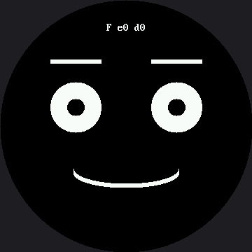

# Only Redraw What Changed

Every animation in this kit so far has been careful about this, and now you find out why — and by
how much.

Wiping the whole screen and rebuilding the whole face to move **one curve** means sending 259,200
bytes to erase, plus every pixel of every eye, eyebrow, and mouth, over and over, to change a few
hundred pixels that actually differ.

## Two Questions, in Order

Ask the **decomposition** question first: *which pixels actually change?* Answer it and you can
erase a small rectangle instead of the whole screen. That is how every video codec, every game
engine, and every windowing system on earth stays fast.

Then ask the second question, the one that separates a guess from engineering: **did it help, and by
how much?** Button A toggles between full and partial redraw while the screen reports two timings
in microseconds:

| Reading | What it measures |
|---|---|
| `e` | Time spent erasing — a full screen, or one small box |
| `d` | Time spent drawing the face parts back |

No expected numbers appear anywhere in the lab on purpose. Nobody has measured this exact program on
a GC9B72 yet, and the smartwatch kit's numbers came off a different chip, running a different
driver, pushing 2.25× fewer pixels — quoting them here would be wrong in three directions at once.
Run it, write down what *your* board says, and compare your two numbers to each other. That
comparison is the measurement, and it is valid on any panel.

## The Answer Is Different From the OLED Kit's, and That Is the Point

On the OLED, the frame buffer had to be shipped in full every time no matter what, so the saving
was real but small and the honest conclusion was "you optimized the cheap part."

**Here there is no frame buffer. Every pixel you skip is a pixel you never send.** Predict what that
does to the numbers before you press the button.

| | OLED kit | This kit |
|---|---|---|
| What a full redraw costs | Whole buffer shipped either way | Whole screen sent, pixel by pixel |
| What partial redraw saves | Drawing time only | Drawing **and** transmission |
| Honest conclusion | "Real, but you optimized the cheap part" | Measure it and see |

Same optimization, same code shape, wildly different payoff. What changed was not the idea — it was
the hardware underneath it. **That is why the measuring step is not optional.** An optimization is
not fast or slow on its own; it is fast or slow *on something*.

## Sample Program Code

```py
# Lab 29: Only Redraw What Changed (excerpt)

MOUTH_RADIUS_X = 75                    # 50 on the smartwatch kit
MOUTH_MARGIN = 6                       # 4 on the smartwatch kit
MOUTH_BOX_X = face.HALF_WIDTH - MOUTH_RADIUS_X - MOUTH_MARGIN
MOUTH_BOX_Y = face.MOUTH_Y - MOUTH_MAX - face.STROKE - MOUTH_MARGIN
MOUTH_BOX_W = (MOUTH_RADIUS_X + MOUTH_MARGIN) * 2
MOUTH_BOX_H = (MOUTH_MAX + face.STROKE + MOUTH_MARGIN) * 2


def erase_everything():
    """The way the OLED labs did it: wipe the entire screen.

    This goes through face.erase() rather than face.clear() so that
    DEBUG_ERASE colors it. Same pixels either way -- but when the whole
    circle flashes red on every frame, nobody has to be talked into
    believing a full wipe is expensive."""
    face.erase(0, 0, face.WIDTH, face.HEIGHT)


def erase_changed_only():
    """Blank only the box the mouth lives in."""
    face.erase(MOUTH_BOX_X, MOUTH_BOX_Y, MOUTH_BOX_W, MOUTH_BOX_H)


def draw_changed_only():
    """The same picture, built by redrawing only the mouth. The eyes and
    eyebrows are simply left alone -- they are already correct on the
    glass from the last frame."""
    face.mouth(face.SMILE, MOUTH_RADIUS_X, mouth_ry)
    draw_hud()
```

Working out from the mouth's center and radii, plus a margin for safety, that box comes out to
162 × 114 pixels at (99, 189) — and it is worth checking a box that size still fits the round
screen, because scaling a rectangle up pushes its corners outward faster than its edges. Its far
corners land 146 px from center, comfortably inside `config.SAFE_RADIUS` of 168.

The full program is `29-partial-redraw.py` in the kit.

Here's the benchmark running:



The `F` means full-redraw mode; `e` and `d` are the erase and draw timings in microseconds. Press
button A and the `F` becomes a `P`, with two very different numbers beside it.

!!! mascot-thinking "Average, Don't Sample"
    { class="mascot-admonition-img" }
    This lab averages ten frames before it reports anything. A single reading of something this fast is mostly noise; an average is a measurement. That habit is worth more than any one number it produces.

## Make the Invisible Visible

Everything above happens where you cannot see it, because erasing paints black onto black. Set one
value — button B toggles it live — and every erase box becomes a colored rectangle with the redrawn
part sitting on top of it:

```py
face.DEBUG_ERASE = config.RED
```

| Mode | What lights up | Pixels repainted |
|---|---|---|
| Full redraw | The entire circle, every frame | 129,600 |
| Partial redraw | One rectangle around the mouth | 18,468 |

129,600 ÷ 18,468 is 7.02 — **seven times fewer**, and nobody has to be talked into believing it.

That seven is worth a second look, because it is the same seven the smartwatch kit gets: there, the
comparison is 57,600 ÷ 8,208, and that also comes out to 7.02. Nobody tuned the two kits to agree.
Going from a 240 px screen to a 360 px one made everything 1.5× wider *and* 1.5× taller, so both the
full-screen count and the mouth-box count grew by exactly the same factor, 2.25×. A ratio whose top
and bottom both scale by the same factor does not move, no matter how big the screen gets. A **count**
of pixels is a fact about one panel and has to be redone for every other panel; a **ratio** of two
areas on the same panel survives the move.

!!! mascot-tip "Watch the e Number While You Toggle the Color"
    { class="mascot-admonition-img" }
    It does not change. A red pixel and a black pixel are both two bytes of RGB565, so making your program explain itself cost you nothing at all. That is rarer than it sounds, and worth taking when you can get it.

## Things to Try

1. **Predict the ratio before you toggle.** You just worked it out above — 7.02 — so predict whether
   the microseconds follow it. Then look. Then go read the
   [OLED kit's version](../../oled/partial-redraw/index.md) of this lab and predict what *it* will
   say. Being right about one and wrong about the other is the lesson landing.
2. **Make the mouth box too small** — change `MOUTH_BOX_H` to 30 — and watch the grin's corners
   smear off the edges of the box you forgot to erase. Partial redraw fails loudly when you get the
   geometry wrong, which is [bug 2](../broken-faces/index.md) wearing a disguise.
3. **Do exercise 2 again with the red erase box on.** The smear is no longer a mystery: the leftover
   pixels are sitting plainly *outside* a rectangle you can see the edges of — and the `e` reading
   is unchanged from when the box was black, proof that the color itself cost nothing.
4. **Change the wire speed and watch the effect.** `config.py`'s `BAUDRATE` is already tuned to this
   board's practical ceiling on the RP2040 — 24 MHz, the top rung of a clock ladder documented in
   `config.py` itself. Drop it to the next rung down, `12_000_000`, and run again: both the `e` and
   `d` readings should get worse, in proportion, because on this display every number here *is* wire
   time.
5. **Add the eye pupils to the animation** so they sweep as well. You now need a third box. At what
   point does tracking boxes get harder than just redrawing the screen? There is no single right
   answer, and knowing that is the skill.

## References

- [Eye Scanner](../eye-scanner/index.md) — where erasing one box instead of the screen first appeared
- [Trace and Watch](../trace-and-watch/index.md) — the measuring habit this lab formalizes
- [How Fast Is a Face?](../draw-speed-timing/index.md) — the other half of the speed story, about batching
- [Only Redraw What Changed on the 1.2" kit](../../smartwatch/partial-redraw/index.md) — the same seven-times ratio, measured on a screen with 2.25× fewer pixels
