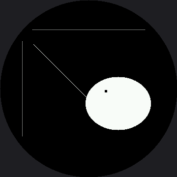

# Drawing Pixels

Every shape in this book — every eye, eyebrow, and mouth — is built from one thing: a single dot
called a **pixel**. The `pixel()` method is the smallest drawing tool the driver gives you, and it
sets exactly one dot.

```py
display.pixel(x, y, color)
```

On the OLED, `color` was 0 or 1. Here it is a 16-bit RGB565 number, and this lab uses two of them:
`config.WHITE` (0xFFFF) and `config.BLACK` (0x0000). Drawing in black is still how you erase.

!!! mascot-thinking "One Pixel Is the Whole Unit of Measure"
    { class="mascot-admonition-img" }
    My screen addresses 360 dots across and 360 down — 129,600 pixels, and about 102,000 of them are actually under the glass. Every one of them is two bytes and I control all of them. Every pixel tells a story!

## The Warning You Will Feel Immediately

Here is the difference that changes how you write code on this display. **Every `pixel()` call is
a separate conversation with the hardware.** Setting one dot means sending a command that opens a
drawing window, four bytes of coordinates, and then two bytes of color.

On the OLED, `pixel()` poked a byte in RAM and cost almost nothing. Run this lab and watch the
dotted rulers appear one dot at a time. That visible crawl is not your imagination — it is the
whole reason `shapes.py` works in horizontal runs, and it is what the
[How Fast Is a Face?](../draw-speed-timing/index.md) lab measures. This screen makes the point
harder than the 1.2" kit's did, too: 360×360 is 129,600 pixels where 240×240 was 57,600, so there
are 2.25 times as many chances to do it the slow way.

| Job | Cheap way | Expensive way |
|---|---|---|
| A row of 100 dots | one `hline()` | 100 `pixel()` calls |
| A filled eye | one `shapes.ellipse()` | a loop over the bounding box |
| A 5 by 5 catchlight | one `fill_rect()` | twenty-five `pixel()` calls |
| A single highlight dot | `pixel()` — this is what it is for | anything else |

## Sample Program Code

This program uses `pixel()` three ways: to build dotted rulers, to draw a diagonal one dot at a
time, and to punch a small highlight out of a finished eye.

```py
import config
import shapes

display = config.init_display()
WHITE = config.WHITE
BLACK = config.BLACK
FILL = config.FILL
CENTER_X = config.CENTER_X
CENTER_Y = config.CENTER_Y

display.fill(BLACK)

# A dotted ruler across the middle: one pixel on, one pixel off.
#
# The SPACING did not scale with the screen. Everything else in this port
# got multiplied by 1.5, but "one on, one off" is a one-pixel pattern, and
# one pixel is one pixel on any panel -- so the step stays 2 and this
# ruler simply carries more dots than the smaller screen's did.
#
# The ENDS did change, and not by scaling either. The screen is round: at
# y=60 the safe circle reaches only 117 px either side of center, so the
# ruler runs 66..294 instead of out to the edge of the square.
for x in range(66, 296, 2):
    display.pixel(x, 60, WHITE)

# a dotted ruler down the left. x=45 is 135 px off center, which leaves
# just under 100 usable rows above and below the midline -- the further
# from the center line you go, the shorter every line gets on a round
# screen.
for y in range(84, 278, 2):
    display.pixel(45, y, WHITE)

# a diagonal drawn one pixel at a time
for i in range(0, 135):
    display.pixel(68 + i, 90 + i, WHITE)

# an eye with a catchlight punched out in black pixels. The eye is one
# shapes.ellipse() call -- fast, because it works in rows -- and the
# catchlight is twenty-five individual pixels, which is still fine
# because there are only twenty-five of them.
shapes.ellipse(display, 240, 210, 66, 54, WHITE, FILL)
for dy in range(5):
    for dx in range(5):
        display.pixel(213 + dx, 183 + dy, BLACK)
```

Here's what that program draws on the display:



## The Catchlight Trick

Look closely at the eye. Those twenty-five black pixels in its upper left are a **catchlight** —
the small bright reflection you see in a real eye. Twenty-five dots is all it takes to make a flat
white blob start reading as something alive and looking at you.

This is also your first look at drawing in **layers**. The `ellipse()` call ran first and filled
the whole shape white. The twenty-five `pixel()` calls ran second, so they overwrote what was
already there. On a display with no frame buffer, later commands always win — and they win
immediately, right on the glass.

!!! mascot-warning "Off-Screen Pixels Just Disappear"
    { class="mascot-admonition-img" }
    Ask for `pixel(450, 90, WHITE)` and nothing happens — no dot, no error, because x=450 is off the addressable 360 by 360 square entirely. Worse, ask for `pixel(15, 15, WHITE)` and it is *accepted*, drawn, and still invisible, because that corner is behind the bezel. Check your coordinates against the circle, not just the 360 by 360 range.

## Things to Try

1. **Time the dotted ruler.** Wrap the first loop in `ticks_us()` readings and print the total.
   Then draw the same 115 dots with one `hline()` and time that — the gap is the cost of talking
   to the display 115 times instead of once. The 1.2" kit's version of this lesson quotes a
   measured number for this trick, but that number came off a GC9A01; run it here and get your
   own.
2. **Replace the catchlight** with a single `fill_rect(213, 183, 5, 5, BLACK)`. Same picture, one
   trip down the wire instead of twenty-five.
3. **Move the catchlight** to the other side of the eye and see how it changes where the eye seems
   to be looking. A few pixels of position carry a surprising amount of meaning.
4. **Push the horizontal ruler out** to `range(30, 330, 2)` — the numbers you'd get by scaling the
   1.2" kit's ruler by a straight 1.5x. Watch the dots at both ends disappear under the bezel,
   because moving a coordinate outward on a round screen moves it toward a rim a square screen
   never had.

## References

- [Screen Coordinates](../screen-coordinates/index.md) — why a valid coordinate can still be invisible
- [How Fast Is a Face?](../draw-speed-timing/index.md) — the lab that measures dots against runs; the 1.2" kit's version of this lab found roughly a 10x gap, but nobody has measured this panel yet
- [Drawing Pixels on the 1.2" kit](../../smartwatch/pixel/index.md) — the same lab at 240×240, before the 1.5x scale
- [MicroPython machine.SPI Documentation](https://docs.micropython.org/en/latest/library/machine.SPI.html) — the bus every one of those pixel calls travels down
