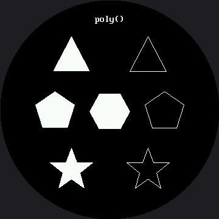

# Drawing Polygons

`poly()` draws any shape you can list points for — triangles, pentagons, stars, and the curved,
angled eyebrows that make a robot face expressive. It is the one drawing command that can point in
a **direction**, which is exactly why the [eyebrow lab](../eyebrows/index.md) reaches for it.

```py
shapes.poly(display, x, y, point_array, color, fill_flag)
```

`point_array` is a MicroPython `array('h', [x0, y0, x1, y1, ...])` of signed shorts. The `'h'`
matters more here than it did on the smaller kit: the OLED kit used `array('B')` — unsigned bytes,
maximum 255 — and that still fit the [1.2" kit's](../../smartwatch/poly/index.md) 240 px screen.
It does **not** fit this one. A coordinate here can be as large as 359, which an unsigned byte
cannot hold, and half the offsets in the shapes below are negative, which an unsigned byte cannot
hold either. Signed shorts solve both problems at once — the range runs from -32,768 to 32,767, so
the storage type stops being something you have to think about.

## How the Fill Works

This driver has no `poly()` of its own, so `shapes.poly()` fills polygons itself using a
**scanline fill**: for each row, find where the shape's edges cross it, sort the crossings, and
fill between them in pairs.

Open `lib/shapes.py` and read it. It is the same algorithm every 2-D graphics library on earth
uses, and it fits on one screen.

!!! mascot-thinking "One Array, Four Positions"
    { class="mascot-admonition-img" }
    Every shape below is written once, as offsets from a center point, and then placed by moving that center. Change the anchor and the shape moves; change the array and the shape changes. Keeping those two ideas separate is most of what makes drawing code readable — on a 360 px screen or a 240 px one.

## Sample Program Code

Four shapes, each drawn filled on one side and outlined on the other so you can compare them.

```py
import config
import shapes
from array import array

display = config.init_display()
ON = config.WHITE
BLACK = config.BLACK
NO_FILL = config.NO_FILL
FILL = config.FILL
FONT = config.SMALL_FONT

CENTER_X = config.CENTER_X          # 180

display.fill(BLACK)

CAPTION = "poly()"
display.text(FONT, CAPTION, CENTER_X - (len(CAPTION) * FONT.WIDTH) // 2, 24,
             ON, BLACK)

# Every shape below is written as offsets from a center point, then
# placed by moving that center. Same array, four positions.
TRIANGLE = array('h', [0, -33, 30, 24, -30, 24])
PENTAGON = array('h', [0, -33, 32, -11, 20, 27, -20, 27, -32, -11])
HEXAGON = array('h', [-17, -29, 17, -29, 33, 0, 17, 29, -17, 29, -33, 0])
STAR = array('h', [0, -36, 9, -12, 35, -12, 14, 5, 21, 30,
                   0, 15, -21, 30, -14, 5, -35, -12, -9, -12])

# row one: filled on the left, outlined on the right
shapes.poly(display, 117, 93, TRIANGLE, ON, FILL)
shapes.poly(display, 243, 93, TRIANGLE, ON, NO_FILL)

# row two
shapes.poly(display, 90, 183, PENTAGON, ON, FILL)
shapes.poly(display, CENTER_X, 183, HEXAGON, ON, FILL)
shapes.poly(display, 270, 183, PENTAGON, ON, NO_FILL)

# row three
shapes.poly(display, 117, 279, STAR, ON, FILL)
shapes.poly(display, 243, 279, STAR, ON, NO_FILL)
```

Here's what that program draws on the display:



Notice the middle row is three shapes wide and the outer rows are two, same as on the smaller kit.
That is the circle deciding your layout for you — the screen is widest across its middle, so that
is where the most shapes fit, no matter how big the circle is.

Every offset and every placement above is the 1.2" kit's number multiplied by 1.5 and rounded — the
triangle's `±22` became `±33`, the star's `23` became `35`, and so on. The one exception is the
caption: `"poly()"` is 6 characters in a fixed 8×16 font, so it is still 48 px wide no matter how
big the screen is, and its x position had to be re-centered on the new `CENTER_X` (180) instead of
being scaled.

## Filled or Outlined Costs Different Amounts

This is worth knowing before you start drawing brows. A filled polygon sends one `hline()` per row
it covers. An outline sends one `line()` per edge. Which one is cheaper depends entirely on the
shape — and depends on it differently at this size, because a shape's *height* scales with the
screen but its *edge count* never does:

| Shape | Filled cost | Outline cost |
|---|---|---|
| A short, wide eyebrow (18 rows, 6 edges) | 18 runs | 6 angled walks |
| A tall star (72 rows, 10 edges) | 72 runs | 10 angled walks |
| A big filled pentagon | grows with **area** | grows with **perimeter** |

A polygon scaled up 1.5x covers 1.5x as many rows, so its filled cost grows — but it still only has
as many edges as it always did, so its outline cost does not. The bigger a shape gets, the more a
filled version costs relative to an outlined one.

!!! mascot-tip "An Outlined Brow Reads as a Scratch"
    { class="mascot-admonition-img" }
    Try drawing an eyebrow with `NO_FILL` and you get a thin wire frame that looks like a scuff on the glass. Filled polygons are what make brows read as brows, on a screen this size or the smaller kit's.

## Things to Try

1. **Turn a triangle into an eyebrow.** Shrink `TRIANGLE`'s `±33` apex down toward its `±24` base
   until the shape is a thin, flat wedge, then place it above an eye. You will have built the
   [eyebrow lab](../eyebrows/index.md).
2. **Add a point to `STAR`** and see what happens. Scanline fill does not care how many points you
   give it, or whether the shape is convex — but it does assume the outline does not cross itself.
   Make it cross itself on purpose and look at the result; the pattern you get is not a bug, it is
   what "inside" means when a shape overlaps itself.
3. **Time the filled star against the outlined one** with `ticks_us()`. Predict which is faster
   first, then find out whether the shape or your intuition was in charge — and remember scaling
   changed the balance, since a star 1.5x wider covers 1.5x as many rows but still has the same ten
   edges.
4. **Check the star's reach against the safe radius.** Each star in row three reaches about 154 px
   from the screen's center at its outer lower point, against a `config.SAFE_RADIUS` of 168. Work
   out how much bigger you could scale `STAR` before that point slides under the bezel, then check
   your answer on the glass — growing a shape that is already off-center pushes its far corner out
   faster than it grows the shape.

## References

- [Eyebrows](../eyebrows/index.md) — where `poly()` becomes the most expressive tool on the face
- [Drawing Lines](../lines/index.md) — the straight-line version of the same idea, and its limits
- [Drawing Polygons on the 1.2" kit](../../smartwatch/poly/index.md) — the same lab on the smaller 240×240 screen, where `array('B')` still fits
- [MicroPython array Documentation](https://docs.micropython.org/en/latest/library/array.html) — what `array('h', ...)` actually builds
