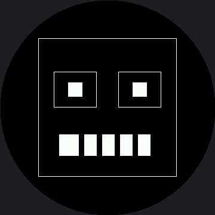

# Drawing Rectangles

Rectangles are the workhorse shape of this kit — not because robot faces are boxy, but because a
filled rectangle is how you **erase** on a display with no frame buffer. Almost every animation in
these labs is built on that one idea.

This driver splits what `framebuf` combined into a single call:

```py
display.rect(x, y, w, h, color)        # outline only -- no fill flag
display.fill_rect(x, y, w, h, color)   # solid block
```

There is no separate "erase" command anywhere in this kit. Drawing in black *is* erasing, and
`fill_rect(..., BLACK)` is the fastest eraser you have, because it is the one call that sends long
runs of identical pixels.

!!! mascot-thinking "The Fastest Eraser You Have"
    { class="mascot-admonition-img" }
    Wiping my whole screen means sending 259,200 bytes. Wiping just the box around my mouth is 11,664. Same result on the glass, about one twenty-second of the work — and that is the difference between a smooth animation and a flicker.

## Sample Program Code

This program draws a border pulled well inside the safe radius, a retro blocky face with square
eye sockets, and a mouth bar with teeth **erased** out of it in black.

```py
import config

display = config.init_display()
WHITE = config.WHITE
BLACK = config.BLACK

display.fill(BLACK)

# A border. On a round screen a rectangular border gets its corners
# clipped, so this one is pulled well inside the safe radius.
#
# Watch how tight that is. A square's corner sits its half-width times
# 1.414 from the center, so this 232 px box has corners 164 px out and
# the safe circle is 168. Straight-scaling the smartwatch kit's border
# (40,40,160,160 becomes 60,60,240,240) would put those corners at 170,
# just past the ring -- so the width is 232 here, not 240. Corners cost
# more than sides do.
display.rect(64, 64, 232, 232, WHITE)

# a retro blocky face: square eye sockets with a filled pupil inside each
display.rect(90, 120, 72, 60, WHITE)
display.fill_rect(114, 138, 24, 24, WHITE)

display.rect(198, 120, 72, 60, WHITE)
display.fill_rect(222, 138, 24, 24, WHITE)

# a wide filled mouth bar with black teeth erased out of it
display.fill_rect(99, 225, 162, 36, WHITE)
for tooth_x in range(132, 261, 30):
    display.fill_rect(tooth_x, 225, 9, 36, BLACK)
```

Here's what that program draws on the display:



## The Teeth Are the Lesson

Those teeth were never drawn. The program painted one solid white bar and then painted five black
bars on top of it, and what is left over reads as a mouthful of teeth.

That is the same layering trick as the catchlight in the [pixel lab](../pixel/index.md), and it is
how nearly every detail in this kit gets made: draw the big shape, then take pieces back out with
black.

| Goal | Approach |
|---|---|
| Solid block of color | `fill_rect(x, y, w, h, color)` |
| Outline | `rect(x, y, w, h, color)` — no fill flag exists |
| Erase a region | `fill_rect(x, y, w, h, BLACK)` |
| Carve detail out of a shape | Draw the shape, then draw black on top |
| Erase everything | `display.fill(BLACK)` — the most expensive call in the kit |

!!! mascot-tip "One Call Takes the Mouth Back"
    { class="mascot-admonition-img" }
    Add `display.fill_rect(99, 225, 162, 36, BLACK)` at the end. The mouth disappears and nothing else on screen moves. That single line is the trick the [Only Redraw What Changed](../partial-redraw/index.md) lab is built on.

## Things to Try

1. **Widen the border** to `display.rect(15, 15, 330, 330, WHITE)` and run it again. The corners
   land about 233 px from the center, past the 180 px glass edge, so you are left with four
   disconnected arcs instead of a box.
2. **Erase just the mouth**, as in the tip above — `fill_rect(99, 225, 162, 36, BLACK)` — and
   confirm the eyes are untouched. Note that the eraser has to match the shape it erases exactly,
   162×36; an eraser that is a size behind is the classic source of leftover smears on a display
   with no frame buffer.
3. **Change the tooth spacing** in the `range(132, 261, 30)` step from 30 to 20. More teeth, no
   new code — the loop does the counting.
4. **Time the two erasers.** Compare `display.fill(BLACK)` against the mouth-sized `fill_rect()`
   with `ticks_us()`. Write both numbers down; you'll want them again at the
   [Only Redraw What Changed](../partial-redraw/index.md) lab.

## References

- [Drawing Pixels](../pixel/index.md) — the same layering idea, at the smallest possible scale
- [Only Redraw What Changed](../partial-redraw/index.md) — where erasing one box instead of the screen becomes a measured optimization
- [Eye Scanner](../eye-scanner/index.md) — the first animation that depends on erasing a box, with real measured timing on this panel
- [Drawing Rectangles on the 1.2" kit](../../smartwatch/rect/index.md) — the same lab at 240×240, before the corner math changed the border's width
