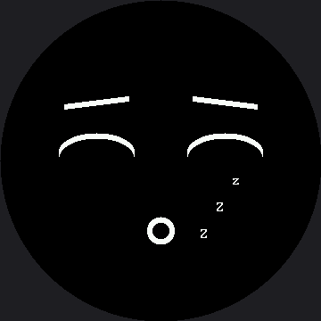

# Sleeping Face

Closed eyes, drooping eyebrows, a small quiet mouth, and three `Z` characters drifting up and away.
This lab is where the round screen stops being a constraint you work around and starts making
design decisions **for** you.

!!! mascot-welcome "Time for a nap"
    { class="mascot-admonition-img" }
    A sleeping robot is one of the friendliest things a machine can be. It says "I'm fine, I'm just resting" — which is exactly what you want a robot to say when it has nothing to do.

## The Zzz Had Nowhere to Go

On the OLED, the `Zzz` sat in the top-right **corner**. This screen has no corners, and neither
does its smaller sibling.

The obvious replacement — up beside the right eye, where the OLED put them — is already occupied.
On this 360×360 circle the eyebrow reaches out to x=288 at that height, and the first `Z` lands
right on top of it. There is no free corner to retreat to.

So the `Z`s drift up and to the right from **beside the mouth**, rising into the empty quarter
below the right eye. That is not a stylistic preference; it is the only clear space left, on this
kit exactly as much as on the smaller one.

| Screen shape | Where the Zzz can live |
|---|---|
| 128 × 64 rectangle (OLED) | The top-right corner, away from everything |
| 240 × 240 circle (1.2" smartwatch kit) | Beside the mouth, rising into the gap under the right eye — the eyebrow reaches x=192 |
| 360 × 360 circle (this kit) | Same idea, bigger numbers — the eyebrow reaches x=288 |

## Sample Program Code

Only the `Z`s move, so only the `Z` box is erased between frames. Everything else is drawn once.
Almost every number below is the smartwatch kit's value times 1.5 — rounded up where needed, like
`BOB_RANGE`'s 5 becoming 8 instead of a fractional 7.5.

```py
import config
import shapes
from utime import sleep

display = config.init_display()
WHITE = config.WHITE
BLACK = config.BLACK
NO_FILL = config.NO_FILL
FILL = config.FILL
FONT = config.SMALL_FONT
FONT_WIDTH = FONT.WIDTH      # 8 -- a bitmap glyph, not a scaled number
FONT_HEIGHT = FONT.HEIGHT    # 16 -- likewise

TOP_HALF = 3  # 1 (top right) + 2 (top left)

HALF_WIDTH = config.WIDTH // 2
EYE_SPACING = 72                          # 48 on the smartwatch kit
LEFT_EYE_X = HALF_WIDTH - EYE_SPACING
RIGHT_EYE_X = HALF_WIDTH + EYE_SPACING
EYE_Y = 159             # 106 on the smartwatch kit
EYE_RADIUS = 42         # 28
SLEEP_RADIUS_Y = 21     # 14
SLEEP_Y = EYE_Y + 11    # EYE_Y + 7
STROKE = 6              # 4

EYEBROW_HALF_WIDTH = 36     # 24 on the smartwatch kit
EYEBROW_Y = EYE_Y - 51      # EYE_Y - 34
EYEBROW_DROOP = 9  # outer corners sag, the way real brows relax before sleep

MOUTH_Y = 258       # 172 on the smartwatch kit
MOUTH_RADIUS = 15   # 10

ZZZ_X = 225         # 150 on the smartwatch kit
ZZZ_Y = 261         # 174
ZZZ_STEP_X = 18     # 12
ZZZ_STEP_Y = 30     # 20
BOB_RANGE = 8       # 5 (7.5, rounded up)

# The rectangle the three Z's live in, with room for the bob at both
# ends. Get this box wrong and the old Z's stay on screen forever.
#
# Note what the width and height are made of. The steps, the bob, and the
# margins all scaled by 1.5 with everything else -- but FONT_WIDTH and
# FONT_HEIGHT are the glyph's real 8 and 16 and are written in as
# themselves. Multiplying those by 1.5 too would size the box for letters
# that do not exist.
ZZZ_BOX_X = ZZZ_X - 6
ZZZ_BOX_Y = ZZZ_Y - ZZZ_STEP_Y * 2 - BOB_RANGE - 3
ZZZ_BOX_W = ZZZ_STEP_X * 2 + FONT_WIDTH + 12
ZZZ_BOX_H = ZZZ_STEP_Y * 2 + BOB_RANGE * 2 + FONT_HEIGHT + 6


def draw_closed_eye(x):
    for offset in range(STROKE):
        shapes.ellipse(display, x, SLEEP_Y + offset, EYE_RADIUS,
                       SLEEP_RADIUS_Y, WHITE, NO_FILL, TOP_HALF)


def draw_eyebrows():
    for offset in range(STROKE):
        display.line(LEFT_EYE_X + EYEBROW_HALF_WIDTH, EYEBROW_Y + offset,
                     LEFT_EYE_X - EYEBROW_HALF_WIDTH,
                     EYEBROW_Y + EYEBROW_DROOP + offset, WHITE)
        display.line(RIGHT_EYE_X - EYEBROW_HALF_WIDTH, EYEBROW_Y + offset,
                     RIGHT_EYE_X + EYEBROW_HALF_WIDTH,
                     EYEBROW_Y + EYEBROW_DROOP + offset, WHITE)


def draw_mouth():
    for offset in range(STROKE):
        shapes.circle(display, HALF_WIDTH, MOUTH_Y, MOUTH_RADIUS - offset,
                      WHITE, NO_FILL)


def draw_zzz(bob):
    display.fill_rect(ZZZ_BOX_X, ZZZ_BOX_Y, ZZZ_BOX_W, ZZZ_BOX_H, BLACK)
    display.text(FONT, 'Z', ZZZ_X, ZZZ_Y + bob, WHITE, BLACK)
    display.text(FONT, 'Z', ZZZ_X + ZZZ_STEP_X,
                 ZZZ_Y - ZZZ_STEP_Y + bob, WHITE, BLACK)
    display.text(FONT, 'z', ZZZ_X + ZZZ_STEP_X * 2,
                 ZZZ_Y - ZZZ_STEP_Y * 2 + bob, WHITE, BLACK)


def draw_sleeping_face():
    """The parts that never move, drawn once."""
    display.fill(BLACK)
    draw_closed_eye(LEFT_EYE_X)
    draw_closed_eye(RIGHT_EYE_X)
    draw_eyebrows()
    draw_mouth()


draw_sleeping_face()

while True:
    for bob in range(-BOB_RANGE, BOB_RANGE):
        draw_zzz(bob)
        sleep(0.15)
    for bob in range(BOB_RANGE, -BOB_RANGE, -1):
        draw_zzz(bob)
        sleep(0.15)
```

Here's one frame of the animation:



## The Erase Box Is Built, Not Scaled

Every position in this file is the smartwatch kit's number times 1.5 — except one. The bitmap font
is a fixed 8×16 glyph baked into `lib/`, and it cannot get bigger just because the screen did. So
`ZZZ_BOX_W` and `ZZZ_BOX_H` are not scaled numbers at all; they are written as an equation built
from `ZZZ_STEP_X`, `ZZZ_STEP_Y`, `BOB_RANGE`, and the font's real `FONT_WIDTH` and `FONT_HEIGHT` —
8 and 16, exactly as they are on the smaller kit.

A naive 1.5× scale of the smartwatch kit's 40×70 box would land at 60×105. The real box here is
56×98 — smaller than the naive guess, because the letters living inside it never got any bigger.
Multiply the font by 1.5 too, and the box would be sized for characters that do not exist.

## Three Signals Saying the Same Thing

Sleep is one of the few expressions where redundancy is the point. Each of these on its own is
ambiguous; together there is no mistaking it:

| Feature | On its own it could mean | Together they mean |
|---|---|---|
| Closed eyes (arcs) | Blinking, winking, laughing | |
| Drooping outer brows | Sad, tired, relaxed | **Asleep** |
| Small round mouth | Surprised, whistling, neutral | |
| Drifting `Zzz` | Only one thing | |

That is a design lesson worth keeping: when an expression has to survive being glanced at, give the
viewer more than one clue.

!!! mascot-warning "Comment Out the Erase and Watch It Smear"
    { class="mascot-admonition-img" }
    Take the `fill_rect()` out of `draw_zzz()` and the Z's pile into a solid white block within seconds. There is no frame buffer here — the glass keeps whatever you last sent it, forever, until you paint over it. That is the bug you will meet most often on this display.

## Things to Try

1. **Break the erase**, as in the warning above, and watch how fast it happens. Then put it back
   and appreciate how much work one rectangle is doing.
2. **Push the Zzz further out** with a bigger `ZZZ_STEP_X` and watch the third one vanish under the
   bezel. The visible glass is a circle of radius 168 around (180, 180), so a Z is only safe while
   `config.inside_circle()` says its far corner is — check the corner, not the anchor, since the
   anchor is the letter's top-left and it is the top-right that leaves the circle first as the
   group climbs.
3. **Swap `FONT` for `config.BIG_FONT`.** The erase box is written in terms of `FONT_WIDTH` and
   `FONT_HEIGHT`, so it resizes itself — the whole reason to write it that way instead of with the
   numbers 8 and 16 spelled out. Bigger Z's read better from a distance, but 16×32 glyphs need more
   room inside the circle than you'd expect, so run step 2's check on the top Z before you trust it.
4. **Slow the bob down** from 0.15 to 0.4 seconds. Breathing rate is a personality trait — a fast
   bob reads as restless, a slow one as deeply asleep.

## References

- [Blinking](../blink/index.md) — where the closed-eye arc was introduced
- [Screen Coordinates](../screen-coordinates/index.md) — why there is no corner to put the Zzz in
- [A Face With a Memory](../state-machine/index.md) — where falling asleep becomes something the robot decides on its own
- [Sleeping Face (1.2" smartwatch kit)](../../smartwatch/sleepy/index.md) — the same lab at 240×240, where the erase box is a plain hard-coded margin instead of the font's real width and height
