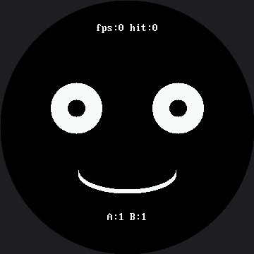

# Trace and Watch

Bug 5 in the [broken faces lab](../broken-faces/index.md) was invisible. Nothing looked wrong in a
photograph of the screen; the program was just too slow to notice a finger. You cannot find a bug
like that by staring at the code, and you certainly cannot find it by guessing.

You have to **measure**.

!!! mascot-welcome "Let's build an instrument"
    { class="mascot-admonition-img" }
    This lab turns my face into its own test equipment. Four numbers on screen, updated live, and suddenly a bug you could only feel becomes a bug you can read.

## Four Numbers That Tell You What Is Really Happening

The heads-up display reports these, and the same numbers go to the Thonny shell once a second so
you have a record you can scroll back through:

| Reading | What it means |
|---|---|
| `loops` | How many times the main loop has run since it started |
| `fps` | Loops per second — the real speed of your program |
| `A` / `B` | What each button pin reads right now (1 = up, 0 = pressed) |
| `hit` | How many presses the program actually managed to notice |

The panel takes the top and bottom strips of the circle and leaves the middle to the face, so the
instruments never sit on top of what they are measuring.

**The panel stays in the small font, and that is a decision, not an oversight.** `face.label()`
draws in the 16×32 font on this kit — great for a one-word headline like "Bug 5", but a readout
like `fps:120 hit:34` would run wide of the safe circle the moment fps hit three digits.
`face.centered_text()` stays in the 8×16 font, where the same string has room to grow:

```py
PANEL_HEIGHT = face.FONT_HEIGHT       # 16, not 24


def draw_panel(a_value, b_value):
    face.erase(0, face.LABEL_Y, face.WIDTH, PANEL_HEIGHT)
    face.centered_text("fps:" + str(fps) + " hit:" + str(presses),
                       face.LABEL_Y)
    face.erase(0, face.BOTTOM_LABEL_Y, face.WIDTH, PANEL_HEIGHT)
    face.centered_text("A:" + str(a_value) + " B:" + str(b_value),
                       face.BOTTOM_LABEL_Y)
```

`PANEL_HEIGHT` is `face.FONT_HEIGHT` — 16 pixels, the actual height of an 8×16 glyph — not the 24
you would get by scaling the smartwatch kit's erase strip by 1.5×. A bitmap font is not a position:
multiplying its height by 1.5 would blank rows of face that no letter ever touches.

## Two Switches, Two Ways to Break It

The lab ships with two flags at the top, both set to `False`. Each one breaks the program in a
completely different way and produces **the same symptom**.

```py
# Set this True to reproduce lab 25's bug 5 on purpose, then watch what
# the heads-up display says about it.
SLOW_MODE = False
SLOW_DELAY_MS = 300

# Set this True to redraw the entire face every frame, the way the OLED
# labs did. It is the second way to break this program, and the one that
# is unique to a display with no frame buffer.
FULL_REDRAW = False
```

| Flag | What it does | Why fps collapses |
|---|---|---|
| `SLOW_MODE` | Adds a 300 ms `sleep()` per loop | The program is asleep instead of working |
| `FULL_REDRAW` | Redraws the whole face every frame | The program is busy sending 259,200 bytes |

Identical symptom, unrelated causes. **That is why you measure instead of guessing.**

## The Instrument Measures a Different Thing Here

One difference from the OLED version is worth noticing. There, the fps you measured was almost
entirely *your code's* speed, because `show()` cost the same 8 milliseconds no matter what.

Here, drawing **is** sending, so this fps number is dominated by how many pixels you chose to
touch. The instrument measures a different thing on different hardware, which is a good thing to
know about instruments in general.

That is also why this page does not print a specific fps figure anywhere. This panel is
360×360 — 129,600 pixels, 2.25 times the smartwatch kit's 57,600 — pushed by a different driver
through a different chip, and nobody has run this exact program on this exact panel and written the
answer down yet. The instrument is real. The reading is yours to take.

!!! mascot-thinking "Counting Frames Between Two Clock Readings"
    { class="mascot-admonition-img" }
    Every game, every robot, and every video player measures its own speed exactly the way this lab does: count how many times you did the thing, then divide by how long it took. That is the whole technique.

## Sample Program Code

Here's the excerpt that does the actual measuring — the main loop, unchanged in structure from
the smartwatch kit, since only the pixel numbers around it are different:

```py
while True:
    loops += 1
    now = ticks_ms()

    a_value = button_a.value()
    b_value = button_b.value()

    # The face blinks on its own timer, exactly as in lab 15.
    if not blinking and ticks_diff(now, last_blink) >= BLINK_EVERY_MS:
        blinking = True
        blink_started = now
    elif blinking and ticks_diff(now, blink_started) >= BLINK_HOLD_MS:
        blinking = False
        last_blink = now

    if a_value == 0 or b_value == 0:
        presses += 1
        face.wait_for_release(button_a if a_value == 0 else button_b)

    if FULL_REDRAW:
        draw_static_parts()
        was_blinking = None

    # Only touch the eyes when they actually changed state. Checking is
    # nearly free; redrawing is not.
    if blinking != was_blinking:
        draw_eyes()
        was_blinking = blinking

    draw_panel(a_value, b_value)
    frames += 1

    # Once a second, work out the real frame rate and report it. Counting
    # frames between two clock readings is how every game, every robot,
    # and every video player measures its own speed.
    if ticks_diff(now, last_report) >= REPORT_EVERY_MS:
        fps = frames
        frames = 0
        last_report = now
        print("loops:", loops, " fps:", fps, " presses:", presses,
              " A:", a_value, " B:", b_value)

    if SLOW_MODE:
        # One innocent-looking line. Watch what it does to fps -- and to
        # how many presses the program manages to notice.
        sleep_ms(SLOW_DELAY_MS)
```

The full program is `26-trace-and-watch.py` in the kit.

Here's the instrument running:



Both buttons read 1 in that picture, which is what "not pressed" looks like. The fps figure needs a
full second of running before it has anything to report.

!!! mascot-tip "Watch the Buttons Change in Real Time"
    { class="mascot-admonition-img" }
    Hold button A down and watch `A:1` become `A:0`. That single digit answers "is my wiring right?" faster than any amount of code reading, and it will save you an afternoon at some point.

## Things to Try

1. **Run it as-is and note the fps.** Then set `SLOW_MODE = True` and note it again. Write both
   numbers down — that ratio **is** the bug, expressed as a number instead of a feeling. Nobody can
   hand you those two numbers; they belong to your board, your wiring, and your SPI baud rate.
2. **Now leave `SLOW_MODE` off and set `FULL_REDRAW = True`.** The program still never sleeps, and
   the fps still collapses. Two causes, one symptom.
3. **With `SLOW_MODE` on, tap button A ten times as fast as you can.** Compare the `hit` counter to
   ten. Every missing press was swallowed by a `sleep()`.
4. **Lower `SLOW_DELAY_MS`** until presses stop getting lost. The number you land on is roughly how
   long a human finger stays on a button — you just measured a person with a microcontroller.
5. **Comment out `draw_panel()`** for ten seconds and watch fps jump. Two text strips are not free
   either, which is exactly the question the [next lab](../partial-redraw/index.md) answers.
6. **Raise `config.BAUDRATE`** and run test 1 again. On a display with no frame buffer, the SPI wire
   is the program's real speed limit, so this one constant may move fps more than anything you
   write. `config.py` documents the exact ladder this board actually lands on — 8, 12, or 24 MHz,
   with nothing reachable in between — so find the highest speed that still draws cleanly and write
   down the fps at each one you try. That table is the first honest performance measurement anyone
   will have made of this panel.

## References

- [Five Broken Faces](../broken-faces/index.md) — bug 5, the invisible one this lab was built to catch
- [Don't Block the Loop](../no-blocking/index.md) — the `ticks_ms()` pattern the blink timer uses
- [Only Redraw What Changed](../partial-redraw/index.md) — where measurement turns into optimization
- [Trace and Watch on the 1.2" kit](../../smartwatch/trace-and-watch/index.md) — the same instrument
  on the smaller 240×240 screen, where `face.label()` is already the small font this kit's panel had
  to switch to on purpose
